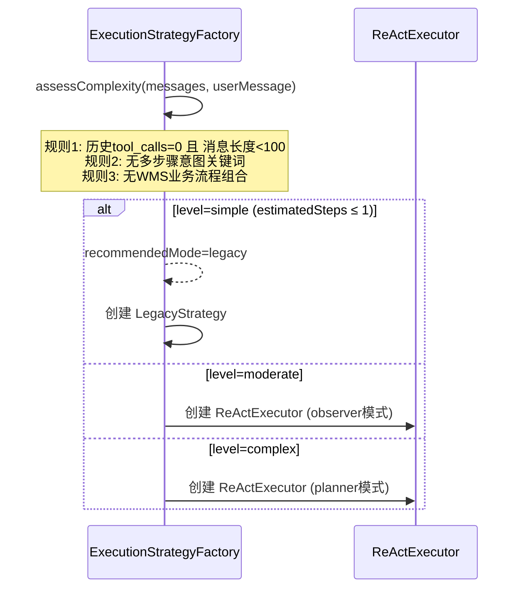
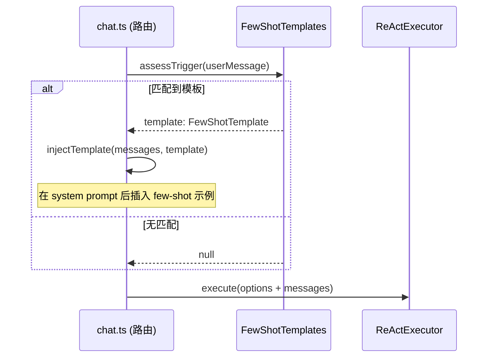
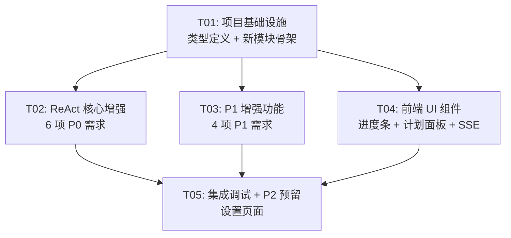

# 架构设计文档：ReAct 循环优化

> 项目：cross-wms-react-optimization
> 架构师：高见远
> 日期：2026-05-25
> 版本：v1.0

---

## Part A: 系统设计

### 1. 实现方案

#### 1.1 核心技术挑战

| # | 挑战 | 分析 | 方案 |
|---|------|------|------|
| C1 | ReAct 循环增强的侵入性 | 现有 `reactExecutor.ts` 是单一大类，各阶段耦合在 `execute()` 主循环中 | 采用 **Phase Hook 模式**：在 `reflectionPhase()` / `actionPhase()` 中插入 hook，而非拆散主循环 |
| C2 | 并行执行的权限安全 | 多工具并行时，高风险工具的权限请求不能并行弹窗 | **分组执行**：auto 组 Promise.all 并行 → confirm/high-risk 组串行逐个请求权限 |
| C3 | Working Memory 的 LLM 压缩 | 旧轮摘要需要调用 LLM，产生额外 token 开销 | **惰性压缩**：仅当滑窗超出 K 轮时才触发，且复用当前 `callAIModelStream`、`reasoningEffort='low'` |
| C4 | 死循环检测的 diff 精度 | 纯文本 Jaccard 可能误判"类似但不同"的输出 | **混合策略**：先 Jaccard 粗筛（>0.8 相似），再错误类型匹配（error message 提取后比较） |
| C5 | Planner DAG 执行与 ReAct 循环的协调 | 现有 `PlannerStrategy` 按步骤串行调用 `ObserverStrategy`，不走 ReAct | **ReAct 内嵌 Planner**：ReAct 循环的 Reflecting 阶段检测偏离 → 触发 Planner 重规划 → 新 steps 注入循环 |
| C6 | 预算管理的 token 计数 | 实际 token 计数依赖 API 响应的 `usage` 字段 | **双模计数**：有 `usage` 时精确累计，无 `usage` 时用 `estimateTokens()` 估算 |

#### 1.2 框架与库选型

| 组件 | 选型 | 理由 |
|------|------|------|
| Schema 校验 | **zod ^4.4.3**（已有依赖） | P1-3 Observation 压缩结果结构校验、P2 工具 outputSchema 预留 |
| 向量库 | **sqlite-vec ^0.1.9**（已有依赖） | P2-3 长期 Memory 预留，不引入外部服务 |
| 文本相似度 | **自实现 Jaccard** | 死循环检测的 diff 计算，无需引入额外包，实现简单（~30 行） |
| 并发控制 | **原生 Promise.all + AbortController** | Action 并行化，无需引入 p-limit 等库 |

#### 1.3 架构模式

- **Phase Hook 模式**：在 ReAct 四阶段（Reasoning/Acting/Observing/Reflecting）中通过 hook 注入增强逻辑，保持主循环结构不变
- **策略模式**（已有）：`ExecutionStrategyFactory` 选择执行策略，ReAct 模式内部增强
- **滑窗 + 惰性压缩**：Working Memory 采用滑动窗口 + 旧轮延迟压缩
- **分组并行**：按工具风险等级分 auto/confirm/high-risk 三组，组内并行、组间串行

---

### 2. 文件列表

#### 2.1 新增文件

| # | 文件路径 | 说明 |
|---|----------|------|
| 1 | `server/engine/workingMemory.ts` | Working Memory 滑窗管理 + 旧轮摘要压缩（P0-4） |
| 2 | `server/engine/budgetManager.ts` | 预算管理：max_turns + max_tokens 累计控制（P0-3） |
| 3 | `server/engine/observationCompressor.ts` | Observation 结果压缩：JSON key-value / 表格 Top-5 / 文本 Top-3（P1-3） |
| 4 | `server/engine/fewShotTemplates.ts` | Few-shot 示例模板定义 + 匹配注入逻辑（P1-2） |
| 5 | `server/engine/loopDetector.ts` | 死循环检测：Jaccard 相似度 + 错误类型 diff + 升级策略（P0-2） |
| 6 | `src/components/CrossWmsChat/ReactPhaseIndicator.tsx` | ReAct 阶段进度条 + 置信度分数显示（P0-1 UI） |
| 7 | `src/components/CrossWmsChat/ExecutionPlanPanel.tsx` | 执行计划面板 + DAG 可视化 + 重规划提示（P0-6 UI） |

#### 2.2 修改文件

| # | 文件路径 | 修改内容 |
|---|----------|----------|
| 1 | `server/engine/reactExecutor.ts` | 核心增强：置信度早停、预算检查、并行 Action、Working Memory 集成、Planner 重规划触发、自评分（P0-1/2/3/5/6, P1-5） |
| 2 | `server/engine/executionStrategy.ts` | 新增 `assessComplexity()` 简单任务跳过 Reasoning、BudgetConfig 透传（P0-3, P1-1） |
| 3 | `server/engine/observer.ts` | Observation 新增 `confidenceScore` 字段支持（P0-1） |
| 4 | `server/engine/planner.ts` | 新增 `detectDrift()` 偏离检测、`replan()` 重规划方法、DAG 拓扑排序执行（P0-6） |
| 5 | `server/engine/contextTruncate.ts` | 集成 Working Memory 滑窗，在截断前先做滑窗裁剪（P0-4） |
| 6 | `src/types/chat.ts` | 新增类型：BudgetInfo、ReflectionConfidence、ComplexityAssessment、ReplanEvent（P0-1/3/6, P1-1） |
| 7 | `src/hooks/useChat.ts` | 新增 SSE 事件处理：`reflection_confidence`、`budget_exceeded`、`complexity_assessment`、`replan_triggered`、`context_compressed`（P0 全局） |
| 8 | `src/components/CrossWmsChat/ChatMessageList.tsx` | 集成 ReactPhaseIndicator + ExecutionPlanPanel 组件（P0-1/6 UI） |
| 9 | `server/engine/toolRegistry.ts` | P2-1 接口预留：RegisteredTool 新增 `outputSchema` 可选字段 |

---

### 3. 数据结构与接口

```mermaid
classDiagram
    direction TB

    class ReActExecutor {
        -observer: Observer
        -planner: Planner
        -state: ReActState
        -workingMemory: WorkingMemory
        -budgetManager: BudgetManager
        -loopDetector: LoopDetector
        +execute(options: ExecutionStrategyOptions) Promise~ReActExecutionResult~
        -reasoningPhase(msgs, ctx) Promise~AIResponse~
        -actionPhase(response, ctx) Promise~Map~ToolCall,string~~
        -observationPhase(results) Observation[]
        -reflectionPhase(observations) ReActReflectionDecision
        -shouldTerminateByBudget() boolean
        -executeParallelActions(toolCalls, ctx) Promise~Map~ToolCall,string~~
    }

    class WorkingMemory {
        -windowSize: number
        -turns: WorkingMemoryTurn[]
        -summaryCache: string
        +addTurn(turn: WorkingMemoryTurn) void
        +getContextMessages() Array~Message~
        +compressOldTurns(modelConfig, signal) Promise~string~
        +getWindowSize() number
    }

    class BudgetManager {
        -maxTurns: number
        -maxTokens: number
        -consumedTokens: number
        -currentTurn: number
        +checkBudget() BudgetCheckResult
        +accumulateTokens(usage: TokenUsage) void
        +incrementTurn() void
        +isExceeded() boolean
        +getRemaining() BudgetRemaining
    }

    class LoopDetector {
        -history: ObservationHistory[]
        -threshold: number
        +detectLoop(observations: Observation[]) LoopDetectionResult
        -calculateJaccard(a: string, b: string) number
        +getEscalationStrategy(result: LoopDetectionResult) EscalationStrategy
    }

    class ObservationCompressor {
        +compress(result: string, maxLength: number) CompressedObservation
        -extractJsonKeyValues(text: string) string
        -extractTableTopRows(text: string, rows: number) string
        -extractTextTopParagraphs(text: string, count: number) string
    }

    class FewShotTemplates {
        -templates: FewShotTemplate[]
        +assessTrigger(userMessage: string) FewShotTemplate~or~null
        +injectTemplate(messages: Message[], template: FewShotTemplate) Message[]
    }

    class Planner {
        +assessTrigger(msgs, userMsg) PlannerTriggerAssessment
        +generatePlan(modelConfig, msgs, signal) Promise~ExecutionPlan~
        +adjustPlan(plan, observation) ExecutionPlan
        +detectDrift(plan: ExecutionPlan, observations: Observation[]) DriftDetectionResult
        +replan(modelConfig, msgs, plan, driftInfo, signal) Promise~ExecutionPlan~
        +topologicalSort(steps: PlanStep[]) PlanStep[][]
    }

    class Observer {
        -ruleEngine: RuleEngine
        +observe(toolCall, result) Observation
        +shouldRetry(observation, retryIndex) boolean
    }

    class ExecutionStrategyFactory {
        +create(mode: ExecutionMode) IExecutionStrategy
        +getDefaultMode() ExecutionMode
        +assessComplexity(messages, userMessage) ComplexityAssessment
    }

    class ReActState {
        +phase: ReActPhase
        +turn: number
        +shouldTerminate: boolean
        +terminateReason: string
        +consecutiveErrorTypeCount: Map~string,number~
        +selfScore: number
        +confidenceScore: number
    }

    class WorkingMemoryTurn {
        +turnIndex: number
        +observations: Observation[]
        +reflectionDecision: ReActReflectionDecision
        +timestamp: number
    }

    class BudgetConfig {
        +maxTurns: number
        +maxTokens: number
        +windowSize: number
    }

    class BudgetCheckResult {
        +exceeded: boolean
        +reason: string
        +consumedTokens: number
        +consumedTurns: number
    }

    class LoopDetectionResult {
        +isLoop: boolean
        +similarity: number
        +consecutiveCount: number
        +errorType: string
    }

    class EscalationStrategy {
        +action: "switch_tool" | "replan" | "ask_user"
        +reason: string
        +alternativeToolName: string
    }

    class DriftDetectionResult {
        +hasDrifted: boolean
        +reason: string
        +originalIntent: string
        +currentDirection: string
    }

    class ComplexityAssessment {
        +level: "simple" | "moderate" | "complex"
        +estimatedSteps: number
        +reason: string
        +recommendedMode: ExecutionMode
    }

    class CompressedObservation {
        +compressed: string
        +original: string
        +wasCompressed: boolean
        +compressionRatio: number
    }

    class FewShotTemplate {
        +id: string
        +name: string
        +triggerPatterns: RegExp[]
        +systemPrompt: string
        +examples: FewShotExample[]
    }

    ReActExecutor --> WorkingMemory : uses
    ReActExecutor --> BudgetManager : uses
    ReActExecutor --> LoopDetector : uses
    ReActExecutor --> Observer : has
    ReActExecutor --> Planner : has
    ReActExecutor --> ReActState : has
    Planner --> DriftDetectionResult : returns
    Planner --> EscalationStrategy : produces
    LoopDetector --> LoopDetectionResult : returns
    LoopDetector --> EscalationStrategy : produces
    BudgetManager --> BudgetCheckResult : returns
    BudgetManager --> BudgetConfig : configured by
    WorkingMemory --> WorkingMemoryTurn : contains
    ExecutionStrategyFactory --> ComplexityAssessment : produces
    ObservationCompressor --> CompressedObservation : returns
    FewShotTemplates --> FewShotTemplate : contains
```



#### 关键类型定义

```typescript
// ===== BudgetManager 相关 =====

interface BudgetConfig {
  maxTurns: number;      // 默认 10
  maxTokens: number;     // 默认 50000，按 total_tokens 累计
  windowSize: number;    // Working Memory 滑窗大小，默认 5
}

interface TokenUsage {
  promptTokens: number;
  completionTokens: number;
  totalTokens: number;
}

interface BudgetCheckResult {
  exceeded: boolean;
  reason: string;       // 'turns_exceeded' | 'tokens_exceeded' | ''
  consumedTokens: number;
  consumedTurns: number;
}

interface BudgetRemaining {
  remainingTurns: number;
  remainingTokens: number;
}

// ===== LoopDetector 相关 =====

interface ObservationHistory {
  turnIndex: number;
  errorType: string;    // 提取自 Observation 的错误分类
  resultDigest: string; // 结果文本的标准化摘要
}

interface LoopDetectionResult {
  isLoop: boolean;
  similarity: number;     // Jaccard 相似度 0~1
  consecutiveCount: number;
  errorType: string;
}

type EscalationAction = 'switch_tool' | 'replan' | 'ask_user';

interface EscalationStrategy {
  action: EscalationAction;
  reason: string;
  alternativeToolName?: string;
}

// ===== WorkingMemory 相关 =====

interface WorkingMemoryTurn {
  turnIndex: number;
  observations: Observation[];
  reflectionDecision: ReActReflectionDecision;
  timestamp: number;
}

// ===== Planner 增强 =====

interface DriftDetectionResult {
  hasDrifted: boolean;
  reason: string;
  originalIntent: string;
  currentDirection: string;
}

// ===== Reflection 增强 =====

interface ReflectionConfidence {
  confidenceScore: number;   // 1-10，≥7 早停
  selfScore: number;         // 1-10，每轮自评分
  shouldEarlyStop: boolean;
  reason: string;
}

// ===== Observation 压缩 =====

interface CompressedObservation {
  compressed: string;
  original: string;
  wasCompressed: boolean;
  compressionRatio: number;  // compressed.length / original.length
}

// ===== Few-shot 模板 =====

interface FewShotTemplate {
  id: string;
  name: string;
  triggerPatterns: RegExp[];
  systemPrompt: string;
  examples: Array<{ role: string; content: string }>;
}

// ===== 复杂度评估 =====

type ComplexityLevel = 'simple' | 'moderate' | 'complex';

interface ComplexityAssessment {
  level: ComplexityLevel;
  estimatedSteps: number;
  reason: string;
  recommendedMode: ExecutionMode;
}

// ===== 前端 SSE 新增事件类型 =====

// reflection_confidence
interface ReflectionConfidenceEvent {
  type: 'reflection_confidence';
  confidenceScore: number;
  selfScore: number;
  shouldEarlyStop: boolean;
  reason: string;
}

// budget_exceeded
interface BudgetExceededEvent {
  type: 'budget_exceeded';
  reason: string;
  consumedTurns: number;
  consumedTokens: number;
  maxTurns: number;
  maxTokens: number;
}

// complexity_assessment
interface ComplexityAssessmentEvent {
  type: 'complexity_assessment';
  level: ComplexityLevel;
  estimatedSteps: number;
  reason: string;
  recommendedMode: string;
}

// replan_triggered
interface ReplanTriggeredEvent {
  type: 'replan_triggered';
  reason: string;
  oldPlanId: string;
  newPlanId: string;
}

// context_compressed
interface ContextCompressedEvent {
  type: 'context_compressed';
  compressedTurns: number;
  summaryLength: number;
}
```

---

### 4. 程序调用流程

#### 4.1 增强 ReAct 主循环（含早停 + 预算 + 并行 + 滑窗 + 重规划）

```mermaid
sequenceDiagram
    participant Client as 前端 useChat
    participant Strategy as ExecutionStrategyFactory
    participant ReAct as ReActExecutor
    participant Budget as BudgetManager
    participant Memory as WorkingMemory
    participant Loop as LoopDetector
    participant Planner as Planner
    participant Observer as Observer
    participant Compressor as ObservationCompressor
    participant AI as callAIModelStream

    Client->>Strategy: sendMessage(executionMode='react')
    Strategy->>Strategy: assessComplexity() [P1-1]
    Strategy-->>Client: SSE: complexity_assessment

    alt 简单任务 (level=simple)
        Strategy->>Strategy: 降级为 Legacy/Observer
    else 复杂任务
        Strategy->>ReAct: execute(options + budgetConfig)
    end

    ReAct->>Budget: 初始化 BudgetManager(budgetConfig)
    ReAct->>Memory: 初始化 WorkingMemory(windowSize=5)

    %% Phase 0: 可选规划
    ReAct->>Planner: assessTrigger(messages, userMessage)
    alt shouldTrigger
        ReAct->>Planner: generatePlan(modelConfig, messages, signal)
        Planner-->>ReAct: plan: ExecutionPlan
        ReAct-->>Client: SSE: execution_plan
    end

    %% 主循环
    loop 每轮 ReAct 循环
        ReAct->>Budget: checkBudget()
        alt 预算超限
            Budget-->>ReAct: { exceeded: true, reason }
            ReAct-->>Client: SSE: budget_exceeded
            ReAct-->>ReAct: 返回当前最优结果
        end

        ReAct->>Budget: incrementTurn()

        %% REASONING
        ReAct->>Memory: getContextMessages()
        Memory-->>ReAct: 滑窗内的消息 + 旧轮摘要
        ReAct->>AI: reasoningPhase(messages + memory)
        AI-->>ReAct: response (content + toolCalls)

        alt 无 tool_calls → 任务完成
            ReAct-->>Client: SSE: react_phase(done)
            ReAct-->>ReAct: 退出循环
        end

        %% ACTING (并行化)
        ReAct->>ReAct: 分组 toolCalls: auto组 / confirm组 / high-risk组

        par auto组并行执行
            ReAct->>ReAct: Promise.all(executeToolCall)
        and confirm组串行
            loop 每个confirm工具
                ReAct-->>Client: SSE: permission_request
                Client-->>ReAct: approved/denied
                ReAct->>ReAct: executeToolCall
            end
        and high-risk组串行
            loop 每个high-risk工具
                ReAct-->>Client: SSE: permission_request
                Client-->>ReAct: approved/denied
                ReAct->>ReAct: executeToolCall
            end
        end

        %% OBSERVING
        ReAct->>Observer: observationPhase(actionResults)
        Observer-->>ReAct: observations[]

        %% Observation 压缩 [P1-3]
        loop 每个observation
            alt result.length > 500
                ReAct->>Compressor: compress(result, 200)
                Compressor-->>ReAct: CompressedObservation
            end
        end

        %% REFLECTING
        ReAct->>ReAct: reflectionPhase(observations)
        Note over ReAct: 生成 confidenceScore + selfScore

        ReAct-->>Client: SSE: reflection_confidence

        alt confidenceScore >= 7 [P0-1 早停]
            ReAct-->>Client: SSE: react_phase(done)
            ReAct-->>ReAct: 退出循环，直接输出
        end

        %% 死循环检测 [P0-2]
        ReAct->>Loop: detectLoop(observations)
        alt isLoop=true
            Loop-->>ReAct: LoopDetectionResult + EscalationStrategy
            alt action=switch_tool
                ReAct->>ReAct: 注入备选工具提示
            else action=replan
                ReAct->>Planner: replan()
                Planner-->>ReAct: newPlan
                ReAct-->>Client: SSE: replan_triggered
            else action=ask_user
                ReAct-->>Client: SSE: 请求用户澄清
            end
        end

        %% Working Memory 滑窗 [P0-4]
        ReAct->>Memory: addTurn(currentTurn)
        alt turns.length > windowSize
            ReAct->>Memory: compressOldTurns(modelConfig, signal)
            Memory-->>ReAct: summary
            ReAct-->>Client: SSE: context_compressed
        end

        %% 预算 token 累计
        ReAct->>Budget: accumulateTokens(usage)

        %% 偏离检测 + 动态重规划 [P0-6]
        ReAct->>Planner: detectDrift(plan, observations)
        alt hasDrifted=true
            ReAct->>Planner: replan(modelConfig, msgs, plan, driftInfo, signal)
            Planner-->>ReAct: newPlan
            ReAct-->>Client: SSE: replan_triggered + execution_plan
        end
    end

    ReAct-->>Client: SSE: react_phase(done)
    ReAct-->>Strategy: ReActExecutionResult
    Strategy-->>Client: 最终响应
```

#### 4.2 简单任务跳过 Reasoning（P1-1）



#### 4.3 Few-shot 注入流程（P1-2）



---

### 5. 待明确事项

| # | 事项 | 当前假设 | 影响范围 |
|---|------|----------|----------|
| 1 | LLM 返回的 `usage` 字段是否稳定可用？ | 假设可用，降级使用 `estimateTokens()` 估算 | BudgetManager |
| 2 | Reflection 置信度评分的 prompt 设计 | 在 Reflection 的 system prompt 中增加"请评估置信度 1-10"指令 | reactExecutor.reflectionPhase() |
| 3 | 并行执行时的错误处理策略 | 一个工具失败不影响同组其他工具，单独记录 | reactExecutor.actionPhase() |
| 4 | Working Memory 压缩摘要的 token 上限 | 每次压缩产出 ≤200 字（~100 tokens） | WorkingMemory.compressOldTurns() |
| 5 | Planner 重规划的最大次数 | 限制为 2 次，避免无限重规划 | reactExecutor 主循环 |
| 6 | Few-shot 模板的触发优先级 | 先匹配 WMS 业务模板，再匹配通用查询模板 | FewShotTemplates.assessTrigger() |
| 7 | P2 接口预留的粒度 | 仅定义接口和类型，实现抛 NotImplementedError | vectorMemory, compositeToolRegistry |

---

## Part B: 任务分解

### 6. 依赖包列表

```
无需新增 npm 依赖。所有功能基于现有依赖实现：
- zod ^4.4.3: Schema 校验（已有）
- sqlite-vec ^0.1.9: 向量库预留（已有）
- better-sqlite3 ^12.6.2: 本地存储（已有）
- uuid ^9.0.0: ID 生成（已有）
```

---

### 7. 任务列表（按依赖顺序排列）

#### T01: 项目基础设施 — 类型定义 + 配置 + 新模块骨架

| 字段 | 值 |
|------|-----|
| **Task ID** | T01 |
| **Task Name** | 项目基础设施：类型扩展 + 配置 + 新模块骨架 |
| **Priority** | P0 |
| **Dependencies** | 无 |
| **预估复杂度** | 中 |
| **涉及文件** | `src/types/chat.ts`（修改）<br/>`server/engine/workingMemory.ts`（新建）<br/>`server/engine/budgetManager.ts`（新建）<br/>`server/engine/loopDetector.ts`（新建）<br/>`server/engine/observationCompressor.ts`（新建）<br/>`server/engine/fewShotTemplates.ts`（新建） |
| **详细描述** | 1. 在 `chat.ts` 中新增所有类型定义：BudgetConfig、TokenUsage、BudgetCheckResult、LoopDetectionResult、EscalationStrategy、WorkingMemoryTurn、DriftDetectionResult、ReflectionConfidence、CompressedObservation、ComplexityAssessment、FewShotTemplate 及所有 SSE 事件类型<br/>2. 创建 `budgetManager.ts`：实现 BudgetManager 类（checkBudget / accumulateTokens / incrementTurn / isExceeded / getRemaining）<br/>3. 创建 `loopDetector.ts`：实现 LoopDetector 类（detectLoop / calculateJaccard / getEscalationStrategy），Jaccard 相似度计算 + 错误类型 diff<br/>4. 创建 `workingMemory.ts`：实现 WorkingMemory 类骨架（addTurn / getContextMessages / compressOldTurns），滑窗管理 + LLM 摘要压缩<br/>5. 创建 `observationCompressor.ts`：实现纯规则压缩（extractJsonKeyValues / extractTableTopRows / extractTextTopParagraphs / compress）<br/>6. 创建 `fewShotTemplates.ts`：定义 5-8 个 Few-shot 模板 + assessTrigger + injectTemplate |

#### T02: ReAct 核心增强 — 早停 + 死循环 + 预算 + 并行 + 滑窗 + 重规划

| 字段 | 值 |
|------|-----|
| **Task ID** | T02 |
| **Task Name** | ReAct 核心增强：6 项 P0 需求落地 |
| **Priority** | P0 |
| **Dependencies** | T01 |
| **预估复杂度** | 高 |
| **涉及文件** | `server/engine/reactExecutor.ts`（修改）<br/>`server/engine/planner.ts`（修改）<br/>`server/engine/observer.ts`（修改）<br/>`server/engine/contextTruncate.ts`（修改）<br/>`server/engine/executionStrategy.ts`（修改） |
| **详细描述** | 1. **reactExecutor.ts** 核心改造：<br/>   - 构造函数接收 BudgetConfig，初始化 BudgetManager / WorkingMemory / LoopDetector<br/>   - `reflectionPhase()` 增强：返回 confidenceScore（1-10），≥7 时 `shouldContinue=false`（P0-1）<br/>   - `actionPhase()` 重构为分组并行：auto 组 Promise.all → confirm 组串行 → high-risk 组串行，每组内重试+熔断（P0-5）<br/>   - 主循环每轮开始调用 `budgetManager.checkBudget()`，超限返回最优结果（P0-3）<br/>   - 主循环 Observing 后调用 `loopDetector.detectLoop()`，升级策略执行（P0-2）<br/>   - 主循环 Reflecting 后调用 `workingMemory.addTurn()`，超 K 轮压缩（P0-4）<br/>   - 主循环 Reflecting 后调用 `planner.detectDrift()`，偏离时 replan（P0-6）<br/>   - 新增 SSE 事件推送：reflection_confidence / budget_exceeded / replan_triggered / context_compressed<br/>2. **planner.ts** 增强：<br/>   - 新增 `detectDrift(plan, observations)`：对比 plan.intent 与当前 observations 方向<br/>   - 新增 `replan(modelConfig, msgs, plan, driftInfo, signal)`：调用 LLM 重新生成计划<br/>   - 新增 `topologicalSort(steps)`：DAG 拓扑排序，返回分层执行组<br/>3. **observer.ts** 增强：`observe()` 返回的 Observation 新增 `confidenceScore` 可选字段<br/>4. **contextTruncate.ts** 增强：在 `truncateContextForModel()` 前先调用 `workingMemory.getContextMessages()` 做滑窗裁剪<br/>5. **executionStrategy.ts** 增强：<br/>   - `ExecutionStrategyOptions` 新增 `budgetConfig` 字段<br/>   - 新增 `assessComplexity()` 静态方法（P1-1）<br/>   - `ReactStrategy` 传递 budgetConfig 给 ReActExecutor |

#### T03: P1 增强功能 — 简单任务跳过 + Few-shot + Observation 压缩 + 自评分

| 字段 | 值 |
|------|-----|
| **Task ID** | T03 |
| **Task Name** | P1 增强功能：4 项 P1 需求落地 |
| **Priority** | P1 |
| **Dependencies** | T01 |
| **预估复杂度** | 中 |
| **涉及文件** | `server/engine/executionStrategy.ts`（修改）<br/>`server/engine/reactExecutor.ts`（修改）<br/>`server/engine/fewShotTemplates.ts`（修改，完善模板）<br/>`server/engine/observationCompressor.ts`（修改，完善压缩）<br/>`server/routes/chat.ts`（修改） |
| **详细描述** | 1. **executionStrategy.ts** — P1-1 简单任务跳过：<br/>   - `assessComplexity()` 完整实现：历史 tool_calls=0 + 消息短 + 无多步骤关键词 → simple → 降级为 Legacy<br/>   - SSE 推送 `complexity_assessment` 事件<br/>2. **reactExecutor.ts** — P1-5 每轮 Reflection 自评分：<br/>   - `reflectionPhase()` prompt 增加"请评估本轮进展质量 1-10"<br/>   - 解析 AI 输出中的 selfScore，随 SSE 推送<br/>   - 最终结果附带 `averageSelfScore`<br/>3. **fewShotTemplates.ts** — P1-2 Few-shot 注入：<br/>   - 完善 5-8 个模板：WMS 库存查询、跨仓调拨、文件操作、数据导出等<br/>   - `assessTrigger()` 匹配逻辑实现<br/>4. **observationCompressor.ts** — P1-3 Observation 压缩：<br/>   - 在 reactExecutor.observationPhase() 后调用 Compressor<br/>   - >500 字的 result 自动压缩为 ≤200 字<br/>5. **chat.ts** 路由集成：<br/>   - 请求体新增 `budgetConfig` 解析<br/>   - 在构建 messages 时调用 `fewShotTemplates.assessTrigger()` 注入模板 |

#### T04: 前端 UI 组件 — ReAct 进度条 + 执行计划面板 + SSE 事件处理

| 字段 | 值 |
|------|-----|
| **Task ID** | T04 |
| **Task Name** | 前端 UI：ReAct 进度条 + 执行计划面板 + SSE 事件集成 |
| **Priority** | P0 |
| **Dependencies** | T01 |
| **预估复杂度** | 中 |
| **涉及文件** | `src/components/CrossWmsChat/ReactPhaseIndicator.tsx`（新建）<br/>`src/components/CrossWmsChat/ExecutionPlanPanel.tsx`（新建）<br/>`src/hooks/useChat.ts`（修改）<br/>`src/components/CrossWmsChat/ChatMessageList.tsx`（修改）<br/>`src/types/chat.ts`（修改，补充前端展示类型） |
| **详细描述** | 1. **ReactPhaseIndicator.tsx**：ReAct 阶段进度条组件<br/>   - 横向 4 段：🧠 Reasoning → 🔧 Acting → 👁 Observing → 🔍 Reflecting<br/>   - 当前阶段高亮，已完成灰显+对勾<br/>   - Reflecting 段旁显示置信度分数 `置信度: 8/10`<br/>   - 预算超出时进度条变橙色 + 标注"⚠️ 预算已达上限"<br/>2. **ExecutionPlanPanel.tsx**：执行计划面板组件<br/>   - 纵向步骤列表 + DAG 依赖连线<br/>   - 每步骤：序号、描述、工具图标、状态标签<br/>   - 重规划时标注"🔄 因偏离原计划，已重新规划"<br/>   - 失败步骤红色 + 原因，新步骤"新增"标签<br/>3. **useChat.ts** SSE 事件集成：<br/>   - 新增 `reflection_confidence` 事件处理 → 更新 streamingMsg.reflectionConfidence<br/>   - 新增 `budget_exceeded` 事件处理 → 更新 streamingMsg.budgetExceeded<br/>   - 新增 `complexity_assessment` 事件处理 → 更新 streamingMsg.complexityAssessment<br/>   - 新增 `replan_triggered` 事件处理 → 更新 streamingMsg.executionPlan<br/>   - 新增 `context_compressed` 事件处理 → 更新 streamingMsg.contextCompressed<br/>4. **ChatMessageList.tsx** 集成：<br/>   - 当 `message.reactPhase` 存在时渲染 ReactPhaseIndicator<br/>   - 当 `message.executionPlan` 存在时渲染 ExecutionPlanPanel<br/>5. **chat.ts** 类型扩展：<br/>   - Message 新增字段：reflectionConfidence / budgetExceeded / complexityAssessment / contextCompressed |

#### T05: 集成调试 + P2 接口预留

| 字段 | 值 |
|------|-----|
| **Task ID** | T05 |
| **Task Name** | 集成调试 + P2 接口预留 + 设置页面 |
| **Priority** | P1 |
| **Dependencies** | T02, T03, T04 |
| **预估复杂度** | 中 |
| **涉及文件** | `server/engine/reactExecutor.ts`（修改，集成调试）<br/>`server/engine/toolRegistry.ts`（修改，P2-1 预留）<br/>`src/components/Layout/SettingsGeneral.tsx`（修改，新增设置项）<br/>`src/contexts/AppSettingsContext.tsx`（修改，新增 budgetConfig 等） |
| **详细描述** | 1. **集成调试**：<br/>   - ReAct 完整循环端到端测试<br/>   - 确保早停/预算/并行/滑窗/重规划互不冲突<br/>   - 确保降级路径正常（ReAct 失败 → Observer → Legacy）<br/>2. **P2 接口预留**：<br/>   - `toolRegistry.ts`：RegisteredTool 新增 `outputSchema?: ZodSchema` 可选字段（P2-1）<br/>   - 定义 `VectorMemory` 接口（P2-3）：store / retrieve / delete，实现抛 NotImplementedError<br/>   - 定义 `CompositeToolRegistry` 接口（P2-2）：discover / register / getCompositeTools，实现抛 NotImplementedError<br/>3. **设置页面新增**（`SettingsGeneral.tsx`）：<br/>   - 默认执行模式下拉选择（Legacy/Observer/Planner/ReAct）<br/>   - 最大循环轮数数字输入（默认 10）<br/>   - 最大 Token 预算数字输入（默认 50000）<br/>   - Working Memory 滑窗大小数字输入（默认 5）<br/>4. **AppSettingsContext 扩展**：<br/>   - 新增 `budgetConfig` / `defaultExecutionMode` / `windowSize` 配置项 |

---

### 8. 共享知识

```
# 跨文件约定

## 命名规范
- 新增 SSE 事件类型统一使用 snake_case：reflection_confidence, budget_exceeded, replan_triggered
- 新增类文件使用 PascalCase：BudgetManager, WorkingMemory, LoopDetector
- 新增接口使用 PascalCase + I 前缀仅在冲突时使用

## 错误码
- BUDGET_TURNS_EXCEEDED: 轮数超限
- BUDGET_TOKENS_EXCEEDED: Token 超限
- LOOP_DETECTED: 死循环检测触发
- REPLAN_TRIGGERED: 重规划触发
- COMPRESSION_FAILED: Working Memory 压缩失败（降级为直接截断）

## SSE 事件推送格式
- 所有新增 SSE 事件通过 onSSEEvent 回调发送
- 事件格式：{ type: string, ...payload }
- type 字段使用 snake_case

## 预算管理
- max_tokens 按 total_tokens（prompt+completion）累计
- 有 API usage 字段时精确累计，无则使用 estimateTokens() 估算
- 超限时返回当前最优结果 + budgetExceeded 标记

## 置信度评分
- confidenceScore 和 selfScore 范围 1-10
- confidenceScore ≥ 7 触发早停
- selfScore 权重 0.6 + Judge 权重 0.4（P1-6 预留，当前仅 selfScore）

## 并行执行
- auto 组：Promise.all 并行执行，失败重试 1 次
- confirm 组：串行执行，每个工具独立请求权限
- high-risk 组：串行执行，每个工具独立请求权限
- 连续 3 次失败标记工具不可用，跳过后续调用

## Working Memory
- 默认滑窗 K=5
- 旧轮摘要 ≤200 字（~100 tokens）
- 压缩使用 reasoningEffort='low' 节省 token

## 死循环检测
- Jaccard 相似度阈值 0.8
- 连续 3 轮相似度 >0.8 触发升级
- 升级顺序：switch_tool → replan → ask_user

## 执行模式
- 保持 Legacy 默认，ReAct 可选
- 简单任务（estimatedSteps ≤ 1）自动降级为 Legacy/Observer

## Few-shot 模板
- 每个模板包含 2-3 个示例
- 匹配后注入到 system prompt 后面
- 注入后首轮 Reasoning 准确率应提升
```

---

### 9. 任务依赖图



**关键路径**：T01 → T02 → T05

**并行可能**：T02、T03、T04 在 T01 完成后可并行开发，最终汇合到 T05 做集成。
