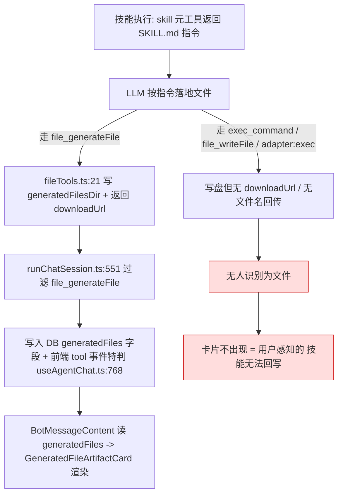
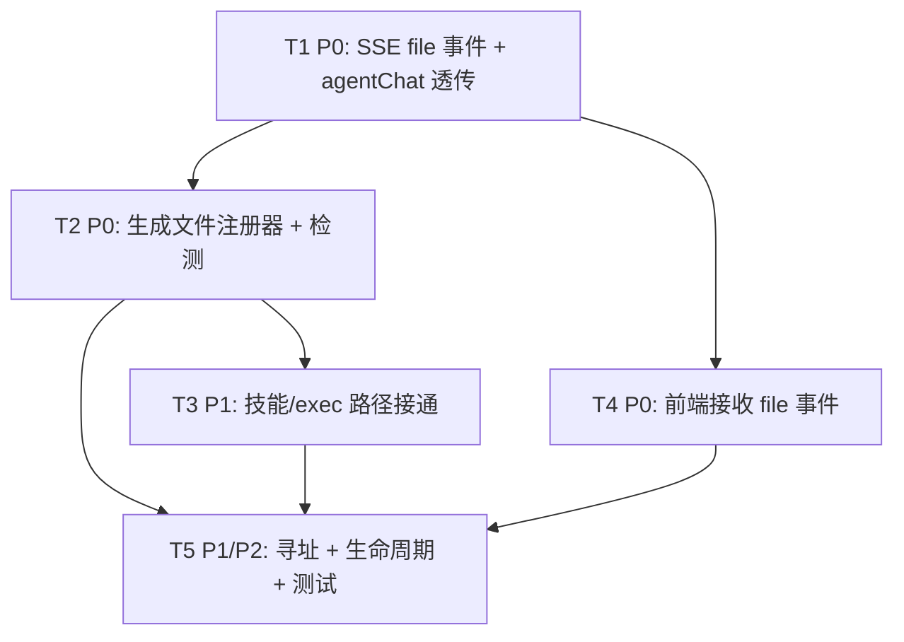

# openclaw vs cross-wms：技能执行 → 文件写回 → UI 附件渲染 链路差异与根因分析

> 分析日期：2026-07-13
> 分析人：高见远（架构师 / software-architect）
> 任务：定位 cross-wms「使用技能无法回写文件」的根因，并给出可落地的分阶段改造方案
> 代码证据均基于实读源码，标注 `文件:行号`；无法证实处明确标注「待确认」

---

## 0. 一句话摘要

**根因**：cross-wms 的「技能执行 → 文件写回 → UI 渲染」链路在**协议层与识别层双重断点**——SSE 协议没有文件附件事件类型；且现有文件附着逻辑被**硬编码为只识别单一工具 `file_generateFile`**（后端 `server/engine/runChatSession.ts:551` 与前端 `src/hooks/useAgentChat.ts:768` 双重写死）。技能只要不是通过 `file_generateFile` 落地文件（现实中最常见的是 `exec_command` 跑脚本、`file_writeFile`、或原生 skill handler `adapter:exec|http`），其产物既不带 `downloadUrl`、也不被任何环节识别为附件，于是 `GeneratedFileArtifactCard` 永远收不到渲染数据。

**改造核心思路**：新增一个与工具无关的 `file` SSE 事件；用一个统一的「生成文件注册器」在**任意**文件产出点（包括 `exec_command` 的 `FILE:/MEDIA:` 标记，复用 openclaw 约定）生成 `downloadUrl` 并 emit 该事件；前端 `useAgentChat.ts` 新增 `case 'file'` 把文件追加进当前消息的 `generatedFiles`，即可复用已存在的 `GeneratedFileArtifactCard` 渲染。

---

## A. 参照实现 openclaw 的三段式是怎么做的

### A.1 技能 / 工具写文件

| 要点 | 证据 |
|------|------|
| 文件落盘到统一的 media 根目录（`resolveMediaDir()`），单文件上限 `MEDIA_MAX_BYTES = 5MB` | `openclaw/src/media/store.ts:29,92` |
| 出站附件通过 `saveMediaBuffer(..., "outbound", ...)` 暂存到 media store，并返回可寻址 `path` | `openclaw/src/media/outbound-attachment.ts:7-53` |
| 工具/技能把产出表示为**消息内容块**（`type:"file" / "image" / "audio"`，带 `url` / `data` / `source`），而不是把路径当纯文本回传 | `openclaw/ui/src/ui/types/chat-types.ts:38-47`（UI 侧 `MessageContentItem.type:"attachment"`） |
| 工具结果中的文件路径标记约定 `^(?:FILE|MEDIA):(.+)$` | `openclaw/src/engine/acp/event-mapper.ts:67`（`TOOL_RESULT_PATH_MARKER_RE`） |

**结论**：openclaw 里"写文件"不是工具的私有副作用，而是把文件固化成一个**带 URL 的内容块**写进 transcript。

### A.2 对话消息携带附件

| 要点 | 证据 |
|------|------|
| artifact 不是独立字段，而是从**会话 transcript 的消息内容块**派生：`type:"file"\|"image"\|"audio"` 且含 `url`/`data`/`source` | `openclaw/src/gateway/server-methods/artifacts.ts:364-380`（`isArtifactBlock`） |
| 派生逻辑 `collectArtifactsFromMessage` 遍历消息 content，识别 `type:file` 块，提取 `title`/`mimeType`/`download.url` 或 base64 `data` | `openclaw/src/gateway/server-methods/artifacts.ts:382-446` |
| artifact 稳定 id 由 `sessionKey + messageSeq + contentIndex + type + title` 哈希得到（`artifact_xxx`） | `openclaw/src/gateway/server-methods/artifacts.ts:269-283` |
| 下载模式：`mode:"url"`（必须是 `/api/` 前缀或 http(s)）或 `mode:"bytes"`（base64） | `openclaw/src/gateway/server-methods/artifacts.ts:306-362, 252-266`（`isSafeDownloadUrl` 要求 `/api/` 前缀） |

**结论**：消息本身"携带附件"= 消息内容里含有 `type:file` 块；前端与后端 gateway 都能从 transcript 直接读出。

### A.3 SSE / 流式事件

| 要点 | 证据 |
|------|------|
| openclaw 不走 cross-wms 这种 `type:tool_call` SSE，而是 **gateway 事件流 + transcript 增量**；附件随 assistant 消息内容块一起流式更新 | `openclaw/src/gateway/server-methods/artifacts.ts`（整套 `artifacts.list/get/download` RPC，而非推送事件） |
| 服务端暴露三个 RPC 供前端枚举/获取/下载附件：`artifacts.list` / `artifacts.get` / `artifacts.download` | `openclaw/src/gateway/server-methods/artifacts.ts:594-677` |

**结论**：openclaw 没有"独立 file 事件"，但它**不需要**——因为附件是消息内容块的一等公民，前端渲染 transcript 时天然拿到；而 cross-wms 的 assistant 消息只是纯文本流 + `tool_call`，文件是"事后补丁"，所以 cross-wms 反而**必须**有一个文件事件才能补齐。

### A.4 UI 渲染卡片

| 要点 | 证据 |
|------|------|
| 归一化后的消息内容含 `type:"attachment"` 块（`url` / `kind` / `label` / `mimeType`） | `openclaw/ui/src/ui/types/chat-types.ts:38-47` |
| UI 通过 `normalizeMessage` + `buildChatItems` 把 attachment 块渲染成卡片；canvas 类产物通过 `appendCanvasBlockToAssistantMessage` 追加到 assistant 消息 | `openclaw/ui/src/ui/chat/build-chat-items.ts:31-73, 750-767` |

---

## B. cross-wms 当前现状

### B.1 SSE 事件类型清单（server/sse/sseTypes.ts）

核心联合类型 `SSEEvent`（`server/sse/sseTypes.ts:135-142`）只含 7 种：

`init` / `text` / `thinking` / `tool_call` / `error` / `done` / `debug`

细粒度扩展（`FINE_GRAINED_EVENT_TYPES`，`:462-478`）含 `text_start/delta/end`、`thinking_*`、`tool_call_start/delta/end`、**`image_start/delta/end`、`audio_start/delta/end`**——**但没有 `file_*` 或任何 `attachment` 事件**。

**确认结论**：
- ❌ 所有事件接口（`SSEInitEvent` / `SSETextEvent` / `SSEToolCallEvent` / `SSEThinkingEvent` …）**均不含 `artifact` / `downloadUrl` / `attachments` 字段**（`sseTypes.ts` 全文件已通读）。
- ❌ 不存在能把"文件附件"推给前端的事件类型。
- ✅ `image_*` / `audio_*` 事件存在，说明设计者考虑过"非文本媒体"事件，但**漏掉了最通用的 `file`**。

后端到前端的实际推送路由 `server/routes/agentChat.ts:182-252` 的 `switch` 仅处理 `init/text/thinking/tool_call/error/done/compaction/output_review/compaction_notification`，`default` 分支把所有未知事件（包括将来新加的 `file`）当作 `debug` 透传——**即现阶段即便后端发 `file` 也会被误分类**。

### B.2 技能执行路径（写文件后发生了什么）

| 环节 | 代码 | 写文件后是否产生"可渲染附件" |
|------|------|------------------------------|
| `file_generateFile`（应用托管目录） | `server/engine/fileTools.ts:21-80` | ✅ 返回 JSON 含 `downloadUrl`/`previewUrl`/`fileName`/`filePath`，写入 `AppPaths.generatedFilesDir/<sessionId>/` |
| `file_writeFile`（任意白名单目录） | `server/engine/fileTools.ts:339-392` | ⚠️ 仅返回 `{success, path, bytesWritten}`，**无 `downloadUrl`、无 `fileName`** |
| `exec_command`（白名单命令） | `server/engine/fileTools.ts:417-468` | ⚠️ 仅返回 `{exitCode, stdout, stderr}` 文本，不识别文件 |
| `skill` 元工具（`skill use`） | `server/engine/skillRuntimeBridge.ts:359-392` | ❌ 只把 SKILL.md 全文作为文本回给 LLM，技能随后"自行"用上面工具落地 |
| 原生 skill handler `adapter:exec` | `server/engine/skillLoader.ts:166-196` | ❌ 返回 `{data:{stdout,stderr}}`，不登记文件 |
| 原生 skill handler `adapter:http` | `server/engine/skillLoader.ts:198-240` | ❌ 返回 fetch 结果，不登记文件 |
| `skill_createProposal`（写技能定义本身） | `server/engine/skillTools.ts:26-133` | ❌ 写的是 `SKILL.md`，属于"技能创作"不是"技能产出文件" |

**后处理（关键断点）**：`server/engine/runChatSession.ts:549-571` 在流结束后，只从 `result.toolCalls` 中**过滤 `tc.name === 'file_generateFile'`** 提取 `generatedFiles`，写进 DB 消息字段（`runChatSession.ts:731-741`，`addMessage(... generatedFiles)`）。`server/db-chat.ts:56` 确实定义了 `generatedFiles?: string | null` 列。

→ **只有 `file_generateFile` 这一个工具的结果会被识别成附件**，且只落 DB（历史重载才有），**全程没有 SSE 文件事件**。

### B.3 UI 已有什么

| 组件 | 行为 | 证据 |
|------|------|------|
| `GeneratedFileArtifactCard` | 渲染单个 `GeneratedFile`（图标 + 文件名 + 大小 + 点击下载/预览），读 `downloadUrl`/`previewUrl` | `src/components/CrossWmsChat/GeneratedFileArtifactCard.tsx:49-149` |
| `BotMessageContent` | 读 `msg.generatedFiles`（`:247`），当 `generatedFiles.length>0` 时渲染 `GeneratedFileArtifactCard` 网格（`:513-557`）；该网格**不依赖是否流式** | `src/components/CrossWmsChat/BotMessageContent.tsx:247,513-557` |
| `useAgentChat.ts` `case 'tool'` | 在收到 `tool` 事件时，**仅当 `toolName === 'file_generateFile'` 且结果 JSON 含 `success/fileName/downloadUrl`** 才把文件塞进当前 assistant 消息的 `generatedFiles`（`:768-790`） | `src/hooks/useAgentChat.ts:739-838` |

**关键结论**：
- `GeneratedFileArtifactCard` 是"数据驱动"的——只要 `msg.generatedFiles` 有数据就渲染，**不挑来源**。
- 但 `msg.generatedFiles` 当前**只有两条输入**：①DB 重载（`runChatSession.ts:731`）、②前端 `tool` 事件里对 `file_generateFile` 的特判（`useAgentChat.ts:768`）。
- 技能若走 `exec_command` / `file_writeFile` / 原生 handler，**两条输入都不命中** → 卡片永远不出现。

---

## C. 根因定位

### 一句话结论

> **cross-wms 在「技能执行 → 文件写回 → UI 渲染」链路上断裂于"文件附着"的识别与传输：SSE 协议层没有文件附件事件类型，且 `generatedFiles` 的填充被硬编码为只识别单一工具 `file_generateFile`（后端 `runChatSession.ts:551` + 前端 `useAgentChat.ts:768` 双重写死）。技能只要不是通过 `file_generateFile` 落地文件（实际多走 `exec_command` / `file_writeFile` / 原生 `adapter:exec|http`），其产物既无 `downloadUrl`、也不被任何环节识别为附件，因此 `GeneratedFileArtifactCard` 收不到数据、无法回写。**

### 证据链（按因果顺序）



1. **协议层缺事件**：`server/sse/sseTypes.ts` 全文件无 `file`/`attachment` 事件、无任何 `artifact`/`downloadUrl` 字段（已通读）；`server/routes/agentChat.ts:182-252` 的 `switch` 也没有 `file` 分支，未知事件落入 `default → debug`。
2. **识别层写死单一工具**：后端 `runChatSession.ts:551` `filter(tc => tc.name === 'file_generateFile')`；前端 `useAgentChat.ts:768` `if (toolName === 'file_generateFile' && toolResult)`。
3. **工具层不产出 URL**：`file_writeFile`（`fileTools.ts:339-392`）返回 `{success, path, bytesWritten}` 无 `downloadUrl`；`exec_command`（`:417-468`）返回 stdout/stderr 文本；原生 handler（`skillLoader.ts:166-240`）返回 stdout/fetch 数据——**三者都不生成可寻址 URL，也不触发任何附件登记**。
4. **UI 组件本身健康**：`GeneratedFileArtifactCard` + `BotMessageContent:513` 是数据驱动、来源无关；问题不在渲染，而在"数据没进来"。

---

## D. 改造方案（可落地的分阶段计划）

### D.1 SSE 协议扩展

**建议：新增一个与工具无关的 `file` 事件**（不要只挂在 `tool_call` 上，因为技能/exec 可能一次产出多个文件且不与单个 tool_call 一一对应）。

```jsonc
// 新增事件：server/sse/sseTypes.ts
{
  "type": "file",
  "fileId": "gen_a1b2c3...",          // 稳定 id = sha256(sessionId + fileName) 截断，用于去重/引用
  "toolCallId": "call_xxx",          // 可选，关联到某次 tool_call
  "source": "skill" | "tool" | "agent", // 产出来源（skill=技能；tool=file_generateFile 等；agent=其他）
  "skillId": "report-gen",           // 可选，产出该文件的技能 id
  "fileName": "库存盘点报告.html",
  "mimeType": "text/html",
  "fileSize": 12345,
  "downloadUrl": "/api/file/generated/<sessionId>/<fileName>",
  "previewUrl": "/api/file/generated/<sessionId>/<fileName>?preview=1",
  "description": "AI 生成的月度库存盘点报告",
  "sessionId": "sess_xxx",
  "createdAt": "2026-07-13T10:00:00.000Z"
}
```

> 字段与前端 `GeneratedFile` 类型（`src/types/chat.ts:131-148`）完全对齐：`fileName/fileSize/mimeType?/description?/downloadUrl/previewUrl?/sessionId?/createdAt?`，额外加 `fileId/toolCallId/source/skillId` 供后端去重与可观测。

**兼容做法**（可选、非必需）：在 `SSEToolCallEvent` 增加可选 `artifacts?: GeneratedFile[]`，让 `tool_call` 自带附件数组（与 openclaw 把附件挂内容块思路类似）。但**主方案用独立 `file` 事件**，覆盖更广。

### D.2 技能工具层改造

新增统一注册器 `server/engine/generatedFileAttachment.ts`：

```ts
// server/engine/generatedFileAttachment.ts（新增）
export interface GeneratedFilePayload {
  fileId: string; fileName: string; mimeType?: string; fileSize: number;
  downloadUrl: string; previewUrl?: string; sessionId?: string;
  description?: string; source: 'skill' | 'tool' | 'agent'; toolCallId?: string; skillId?: string;
}

/** 由 sessionId + fileName 生成稳定 fileId（对齐 openclaw artifactId 思路） */
export function makeFileId(sessionId: string, fileName: string): string { /* sha256 → base64url 截断 18 */ }

/** 确保文件落在 AppPaths.generatedFilesDir/<sessionId>/ 并可寻址；返回 payload */
export function buildGeneratedFilePayload(sessionId: string, fileName: string, opts?: { mimeType?: string; description?: string; source?: ...; skillId?: string }): GeneratedFilePayload { /* 复用 fileTools 的 downloadUrl 规则 */ }

/** 从已知工具结果 JSON 中提取附件（file_generateFile 必支持；file_writeFile 需补 fileName） */
export function extractGeneratedFileFromToolResult(toolName: string, resultJson: string): GeneratedFilePayload | null { /* ... */ }

/** 从 exec 输出中按 FILE:/MEDIA: 标记抽取路径（复用 openclaw 约定 event-mapper.ts:67） */
export function extractFilesFromMarkerText(text: string): string[] { /* /^FILE:.../gm, /^MEDIA:.../gm */ }

/** 通过现有 onEvent 回调 emit 一个 file 事件 */
export function emitFileEvent(send: (e: Record<string, unknown>) => void, p: GeneratedFilePayload): void { send({ type: 'file', ...p }); }
```

**接入点**：
1. `runChatSession.ts` 的 `onToolCall` 回调（`:436-450`）与 streamExecutor 工具执行包装：每次工具结果回来后调用 `extractGeneratedFileFromToolResult`，命中即 `emitFileEvent`。
2. `exec_command`（`fileTools.ts:417`）：执行结果回来后，对 stdout/stderr 跑 `extractFilesFromMarkerText`；命中的路径若落在 `AppPaths.generatedFilesDir/<sessionId>/`（或由 `file_writeFile` 规范约束到该目录）则 emit `file` 事件。**这样技能脚本只要 `print("FILE:/abs/path")` 即可被识别**——直接复用 openclaw 的 `FILE:|MEDIA:` 约定。
3. `file_writeFile`（`fileTools.ts:339`）：补充返回 `fileName`（已能从 `args.path` 取 basename）与 `downloadUrl`（新增 API 路由 `/api/file/fs?path=...` 或统一落到 generated dir），使其也能被识别。
4. `skillLoader.ts` 的 `adapter:exec` / `adapter:http`（`:166-240`）：执行后若产物为文件（stdout 是 `FILE:` 标记，或 http 下载到本地），emit `file` 事件。
5. **约定层**：在 SKILL.md 模板 / `skillRuntimeBridge` 注入规范——"技能产物请写到 session 生成目录，或用 `file_generateFile`，或在脚本里 `print('FILE:<绝对路径>')`"。

### D.3 UI 层改造

`src/hooks/useAgentChat.ts` 新增 `case 'file':`（与 `case 'tool'` 同级），把 payload 追加进当前 assistant 消息的 `generatedFiles`，按 `fileId`/`fileName` 去重：

```ts
case 'file': {
  const f = data as GeneratedFile & { fileId?: string };
  setMessages((prev) => {
    const idx = blockStateRef.current.assistantMessageIndex;
    if (idx < 0 || idx >= prev.length) return prev;
    const last = prev[idx];
    if (last.role !== 'assistant') return prev;
    const arr = last.generatedFiles ? [...last.generatedFiles] : [];
    const key = (f as any).fileId || f.fileName;
    if (!arr.some((x) => ((x as any).fileId || x.fileName) === key)) arr.push(f);
    const next = [...prev]; next[idx] = { ...last, generatedFiles: arr };
    return next;
  });
  break;
}
```

> `BotMessageContent.tsx:513-557` 已能从 `msg.generatedFiles` 渲染 `GeneratedFileArtifactCard`，**无需改动**；`GeneratedFileArtifactCard` 也无需改动。前端"渲染"能力已就绪，只差数据流入。

同时 `server/routes/agentChat.ts:182-252` 必须新增 `case 'file': send('file', event.data)`，否则 `file` 事件会掉进 `default → debug`（当前 bug）。

### D.4 文件存储约定

| 项 | 约定 |
|----|------|
| 规范落盘位置 | `AppPaths.generatedFilesDir/<sessionId>/<fileName>`（沿用 `fileTools.ts:8-18`；`/api/file/generated/:sessionId/:fileName` 已存在，`file.ts:613`） |
| 命名 | `<时间戳>_<skillId>_<原名>` 或保留原名；重名加序号后缀（沿用 `fileTools.ts:52-61`） |
| fileId | `sha256(sessionId + fileName)` 截断，用于去重与引用（对齐 openclaw `artifactId`） |
| 非托管目录文件 | `file_writeFile`/`exec_command` 写到 Desktop/Documents/cwd 的文件——**优先要求技能产物落入 generated dir**；若需支持任意目录，新增 `/api/file/fs?path=...`（复用 `file.ts` 的 `securityCheck`） |
| 生命周期 | session 级；session 删除时应清理其 generated 目录（**清理逻辑待确认**，见 §待明确问题） |
| 大小上限 | 沿用 5MB（`fileTools.ts:40`） |

### D.5 分阶段任务清单（有序、含依赖、含优先级）

| 任务 | 优先级 | 依赖 | 涉及文件（相对仓库根） | 一句话职责 |
|------|--------|------|------------------------|------------|
| **T1** SSE `file` 事件 + 路由透传 | P0 | 无 | `server/sse/sseTypes.ts`、`server/routes/agentChat.ts` | 在 sseTypes 定义 `SSEFileEvent` 并登记联合类型；agentChat 的 switch 新增 `case 'file'` 正确透传（修掉被当 debug 的 bug） |
| **T2** 统一生成文件注册器 + 检测 | P0 | T1 | 新增 `server/engine/generatedFileAttachment.ts`；改 `server/engine/fileTools.ts`（`file_writeFile` 补 fileName/downloadUrl）、`server/engine/runChatSession.ts`（onToolCall 后 emit） | 提供 makeFileId/buildGeneratedFilePayload/extractGeneratedFileFromToolResult/extractFilesFromMarkerText/emitFileEvent；在工具结果返回后自动 emit `file` 事件 |
| **T3** 技能 / exec 路径接通 | P1 | T2 | `server/engine/fileTools.ts`（exec_command 扫描 `FILE:/MEDIA:`）、`server/engine/skillLoader.ts`（adapter:exec/http 执行后 emit）、`server/engine/skillRuntimeBridge.ts`（注入 SKILL.md 约定）、SKILL.md 模板/约定文档 | 让非 `file_generateFile` 的技能落地文件也能被识别并 emit `file` 事件 |
| **T4** 前端接收并渲染 `file` 事件 | P0 | T1,T2 | `src/hooks/useAgentChat.ts`（`case 'file'` 追加 `generatedFiles`）、`src/types/chat.ts`（确认 `GeneratedFile` 含可选 `fileId`） | 收到 `file` 事件即把文件追加进当前 assistant 消息，复用 `GeneratedFileArtifactCard` 实时渲染 |
| **T5** 存取寻址 + 生命周期 + 测试 | P1/P2 | T2,T3,T4 | `server/routes/file.ts`（可选 `/api/file/fs`）、`server/dao/chat.ts`（session 删除清理 generated 目录）、`src/components/CrossWmsChat/__tests__/GeneratedFileArtifactCard.test.tsx`、`src/components/CrossWmsChat/__tests__/BotMessageContent.artifacts.test.tsx` | 保证任意目录产物可下载；session 清理；补充 file 事件回归测试 |

#### 任务依赖图



#### 验收口径（Done 定义）
- 用任意技能（走 `exec_command` 跑脚本 / `file_writeFile` / 原生 handler）产出文件后，对话内**实时**出现可预览/下载的 `GeneratedFileArtifactCard`。
- 刷新页面（从历史 DB 重载）后卡片仍在（DB `generatedFiles` 字段仍由 `runChatSession.ts:731` 兜底）。
- 不产生重复卡片（`fileId` 去重）。

### 待明确问题（待确认项）

1. **用户遇到的"技能无法回写"具体走哪条路径？** 证据强烈指向非 `file_generateFile`（exec/原生 handler），但建议复现一次以确认是 `exec_command` 跑脚本还是原生 `adapter:exec`，影响 T3 的重心。
2. **`file_writeFile` / 脚本写到 Desktop/Documents/cwd 的文件是否要支持回写卡片？** 若支持需新增 `/api/file/fs?path=...`（复用 `file.ts` securityCheck）；若不支持，则 T3 需强制技能产物落入 generated dir，并在 SKILL.md 约定里写死。
3. **session 删除时 generated 目录是否清理？** 通读 `server/dao/chat.ts` 未发现清理逻辑（**待确认**），T5 需补上避免磁盘堆积。
4. **前端 `msg.generatedFiles` 双重来源（实时 `file` 事件 + DB 重载）的去重口径**需一致——建议统一以 `fileId`（sha256(sessionId+fileName)）为主键。
5. **是否演进为 openclaw 式"消息内容块 (type:file) 一等公民"模型？** 短期建议最小改动（复用 `generatedFiles` + 新增 `file` 事件）；中长期若要把图片/音频/文件统一为内容块，再做消息模型升级（不在本改造范围）。

---

## 附录：架构对比表（openclaw vs cross-wms）

| 维度 | openclaw（参照实现） | cross-wms（待改造） |
|------|----------------------|---------------------|
| **技能写文件机制** | 工具/技能把产出写成媒体块（带 `url`/`data`），落盘 media 根（`resolveMediaDir()`，`MEDIA_MAX_BYTES=5MB`）；出站附件经 `saveMediaBuffer` 暂存 | `file_generateFile` 写 `generatedFilesDir/<sessionId>/`；`file_writeFile` 写 Desktop/Documents/cwd；`exec_command`/原生 handler 任意写盘 |
| **消息附件类型** | 消息 content 含 `type:"file"` 内容块（`url`/`data`/`source`）；`artifacts` 由 transcript 派生（`artifacts.ts:364-446`） | DB 消息字段 `generatedFiles`（JSON 数组，`db-chat.ts:56`），**仅 `file_generateFile` 被填充**，历史重载才有 |
| **SSE / 流式事件** | 无独立 file 事件；附件随 assistant 消息内容块流式更新；gateway `artifacts.list/get/download` 派生并服务 | **无 file 事件**；仅 `tool` 事件带工具结果文本；前端 `useAgentChat.ts:768` 仅解析 `file_generateFile` 结果 |
| **UI 渲染组件** | `build-chat-items.ts` 归一化 attachment 块 → 卡片（`chat-types.ts:38-47`） | `GeneratedFileArtifactCard` + `BotMessageContent` 读 `msg.generatedFiles`（数据驱动、来源无关，已就绪） |
| **前端取文件接口** | media store + `/api/...`（`isSafeDownloadUrl` 要求 `/api/` 前缀） | `/api/file/generated/:sessionId/:fileName`（`file.ts:613`，已存在且可用） |

### 关键代码证据索引

| 结论 | 证据 |
|------|------|
| SSE 无 file 事件 | `server/sse/sseTypes.ts`（全文件，联合类型 `:135-142`、`:462-478`） |
| 路由不识别 file 事件 | `server/routes/agentChat.ts:182-252`（`default → debug`） |
| 后端只认 file_generateFile | `server/engine/runChatSession.ts:551, 731-741`；`server/db-chat.ts:56` |
| 前端只认 file_generateFile | `src/hooks/useAgentChat.ts:768-790` |
| file_writeFile 无 downloadUrl | `server/engine/fileTools.ts:339-392` |
| exec_command 不识别文件 | `server/engine/fileTools.ts:417-468` |
| 原生 skill handler 不登记文件 | `server/engine/skillLoader.ts:166-240` |
| GeneratedFileArtifactCard 数据驱动 | `src/components/CrossWmsChat/GeneratedFileArtifactCard.tsx`；`src/components/CrossWmsChat/BotMessageContent.tsx:513-557` |
| 前端 GeneratedFile 类型 | `src/types/chat.ts:131-148` |
| openclaw 附件派生 | `openclaw/src/gateway/server-methods/artifacts.ts:364-446, 594-677` |
| openclaw FILE:/MEDIA: 标记约定 | `openclaw/src/engine/acp/event-mapper.ts:67` |
| openclaw media 根目录 | `openclaw/src/media/store.ts:29,92`；`openclaw/src/media/outbound-attachment.ts:7-53` |

---

*相关背景文档（同 `deliverables/`）：`in-conversation-skill-analysis-2026-07-13.md`、`openclaw-skills-vs-cdf-分析与下一步.md`、`runtime-issues-diagnosis.md`。本分析基于实读源码，与前述报告互补，聚焦"技能回写文件"这一具体断点。*
