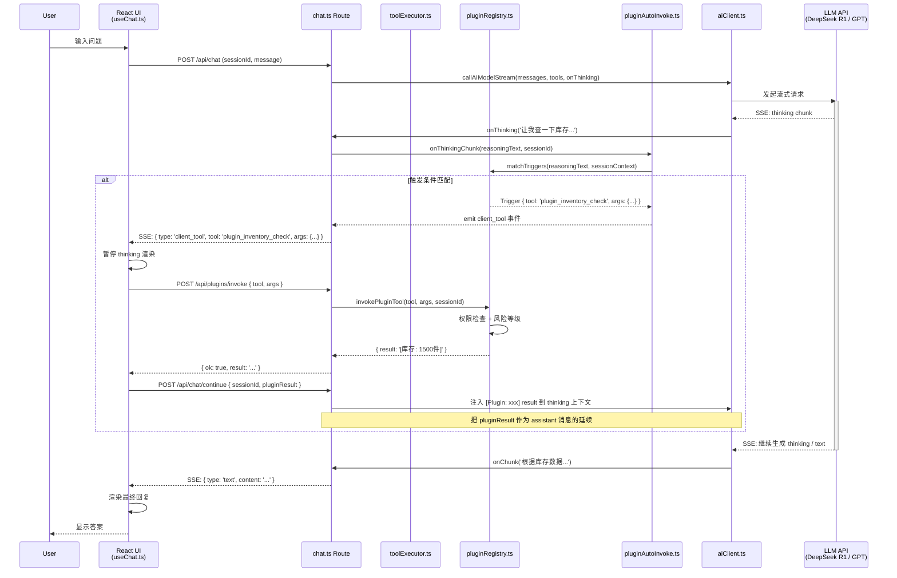
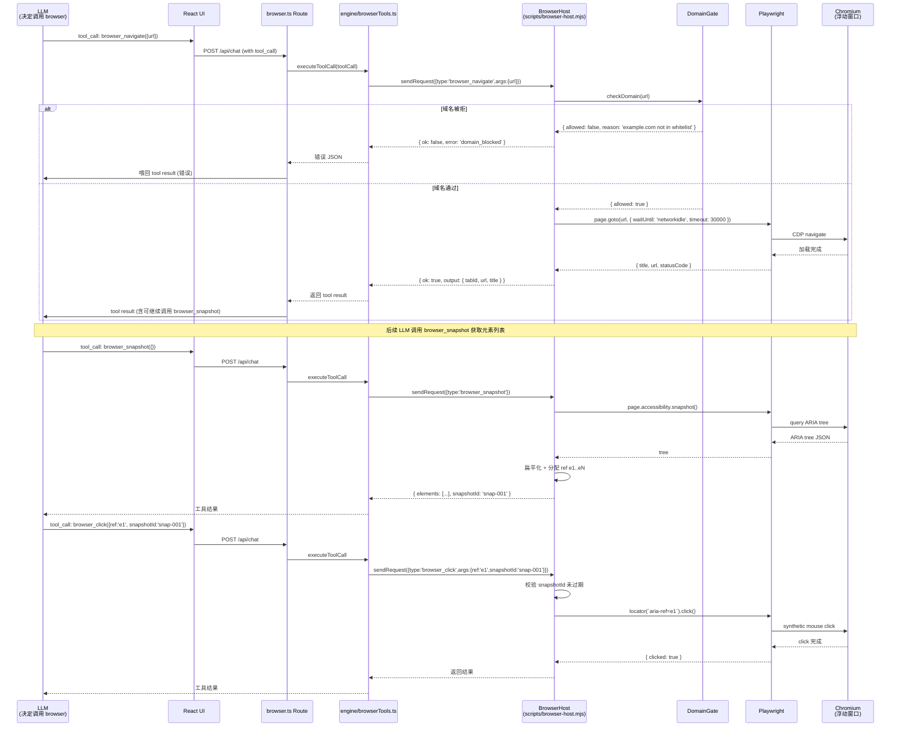
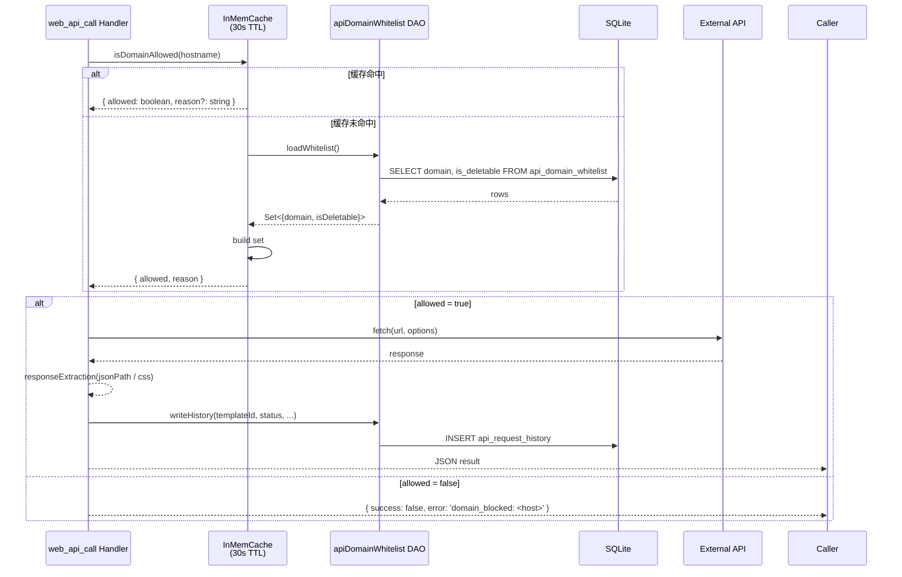
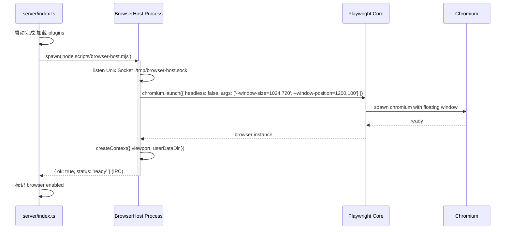

# CrossWMS Tools v3.0 — 架构设计文档

> **作者**：架构师高见远 (software-architect-2)
> **日期**：2026-06-15
> **版本**：v1.0
> **状态**：架构定稿,待工程实施
> **依赖 PRD**：`deliverables/software-company/tools-v3-prd.md`

---

## 0. 文档目标

本设计文档是 CrossWMS Tools v3.0 三个方向(Plugin System / Browser 工具 / HTTP 工具整合)的系统级架构方案,作为工程实施的唯一参考。文档遵循以下原则:

1. **向后兼容** — 不破坏现有 18 个内置工具、chainExecutor、toolExecutor、3 个 Web 工具的对外接口
2. **file:// 友好** — 严格规避动态 `import()`、不依赖 ES Module 动态加载
3. **单进程边界清晰** — 明确划分 pywebview 窗口、Node.js 后端、Playwright 独立进程三者边界
4. **数据迁移最小化** — 现有 SQLite 表结构优先,新增表全部以 `CREATE TABLE IF NOT EXISTS` 形式幂等迁移

---

## 1. 现有代码分析

### 1.1 当前 toolExecutor.ts 架构

**位置**：`server/engine/toolExecutor.ts` + `server/engine/toolRegistry.ts`

**核心结构**:
```
┌──────────────────────────────────────────────────────────────┐
│  executeToolLoop (toolExecutor.ts)                          │
│  ├─ for turn in 0..maxToolTurns:                            │
│  │   ├─ callAIModelStream(...)  ← SSE 流式 + onThinking 回调│
│  │   ├─ 检查 response.tool_calls                            │
│  │   ├─ 对每个 tool_call:                                    │
│  │   │   ├─ 权限检查(needsPermission + approvedToolsCache)  │
│  │   ├─ executeToolCall(toolCall)                           │
│  │   │   └─ registry: Map<string, RegisteredTool>           │
│  │   │       └─ tool.handler(args)  → JSON.stringify(result)│
│  │   └─ 把 tool result push 到 messages,继续下一轮          │
└──────────────────────────────────────────────────────────────┘
```

**关键点**:
- `RegisteredTool = { definition, handler }`,handler 签名固定为 `(args) => Promise<string>`(返回 JSON 字符串)
- `getToolDefinitions()` 返回所有 tool schemas,传入 LLM
- `TOOL_RISK_LEVELS` 硬编码映射,默认 'confirm'
- 工具 risk level 决定是否触发 `onPermissionRequest` 回调
- `approvedToolsCache`(Session 级)实现"同会话内一次授权,全局生效"
- `reasoning_content`(DeepSeek R1)和 `reasoning`(OpenAI o3/o4-mini)在 `callOpenAICompatibleStream` 中已经解析,可通过 `onThinking` 回调

### 1.2 当前 chainExecutor.ts 架构

**位置**：`server/services/chainExecutor.ts`

**核心结构**:
- 按节点顺序执行 skill chain
- 每个节点读取 `user_skills.promptTemplate`,调用 AI 模型,产出 `previousOutput`
- 三种 `dataPassMode`:`full` / `fields` / `custom`
- 通过 SSE 向前端广播事件(`chain-step-start` / `chain-step-complete` / `chain-aborted`)
- **缺失的能力**:无 `onReasoning` / `onToolCall` / `onResult` Hook,无法在执行过程中插入外部逻辑

### 1.3 当前 webTools.ts 架构

**位置**：`server/engine/webTools.ts`

**3 个 Web 工具**:
| 工具 | 功能 | 风险等级 | 域名限制 |
|------|------|----------|----------|
| `web_search` | DuckDuckGo HTML 搜索 | auto | 无 |
| `web_fetch` | HTTP 抓取 + HTML→Markdown | auto | 仅 http/https |
| `web_api_call` | REST API 调用 | confirm | 11 个硬编码域名 |

**已知缺陷**:
- 域名白名单硬编码在 `API_DOMAIN_WHITELIST` Set 中,无 UI 管理入口
- `web_api_call` 方法枚举已包含 PUT/DELETE,但 PRD 提到需扩展 PATCH(注:`toolRegistry.ts:1550` 当前 `method` 枚举为 `['GET','POST','PUT','DELETE']`,**需追加 `PATCH` 和 `OPTIONS`**)
- 无 Auth 头管理(Bearer / Basic),每次需在 args.headers 手写
- 无响应提取(JSONPath / CSS Selector),原始数据全量返回
- 无请求历史与重放

### 1.4 前端流式消费架构

**位置**：`src/hooks/useChat.ts` + `src/components/CrossWmsChat/`

**流式消费链路**:
```
POST /api/chat
  ↓
ReadableStream 逐块读取
  ↓
JSON.parse('data: {...}') 按 type 分类
  ├─ type='text'       → 累积到 pendingContent,定时器 10ms 切片渲染
  ├─ type='thinking'   → streamingMsg.thinking 累积
  ├─ type='tool_call'  → ToolCallBlock 组件
  └─ type='done'       → 收尾
  ↓
onSessionUpdate 通知 React 重新渲染
```

**关键发现**:
- 前端已有 `streamingMsg.thinking` 字段,直接支持 thinking 流式展示
- ToolCallBlock 已能渲染 LLM 发起的 tool_call
- **缺失**:无 reasoning 流中**客户端触发工具**的能力(即 Plugin 注入点)

### 1.5 现有数据库关键表

- `user_skills` — 用户安装的技能(已有 `promptTemplate`、`executionMode`)
- `automations` / `automation_runs` — 自动化任务
- `skill_chains` / `skill_chain_nodes` / `skill_chain_executions` — 技能链
- `app_settings` — K-V 通用配置(可用于存 Plugin 全局开关)
- 已有 18 个内置工具 + 3 个 web_tools(总计 21 个)

### 1.6 需要改造的关键点汇总

| # | 位置 | 现状 | 改造点 |
|---|------|------|--------|
| 1 | `toolRegistry.ts:1550` | `web_api_call` method 枚举 | 追加 PATCH,OPTIONS |
| 2 | `webTools.ts:12-24` | 域名白名单硬编码 | 抽到数据库 + 启动加载 |
| 3 | `chainExecutor.ts` | 无 Hook | 注入 `onReasoning` / `onToolCall` / `onResult` |
| 4 | `chat.ts` 路由 SSE | 单轮 tool 调度 | 支持 reasoning 中 Client-Tool 协议 |
| 5 | `useChat.ts` | 流消费 | 解析 `client_tool` 事件,客户端拼接 `[Plugin: xxx]` |
| 6 | `vite.config.ts` | chunk 拆分策略 | 新增 vendor-playwright 预留 |
| 7 | `toolExecutor.ts:42` | TOOL_RISK_LEVELS 硬编码 | 加载 plugin 后注入动态工具风险等级 |

---

## 2. 实现方案 + 框架选型

### 2.1 方向 1:Plugin System

#### 2.1.1 技术选型

| 子需求 | 选型 | 理由 |
|--------|------|------|
| Plugin 加载 | **Node.js 原生 ES Module 静态 import** | 与现有 ESM(`"type": "module"`)一致,无需打包工具;file:// 友好 |
| Plugin Manifest | **JSON 文件 (`plugin.json`)** + Zod 校验 | 比 YAML 易解析,生态成熟,Zod 已支持 TypeScript 类型推导 |
| Plugin 隔离 | **沙箱 I:Node `vm` 模块** (P1 阶段) | 零依赖,可对每个 plugin 限制 `require` 白名单 |
| WASM 运行时 (P2) | **Wasmtime (Rust)** 或 **QuickJS-emscripten** | 暂不实现,留接口 |
| 客户端拼接标记 | **`[Plugin: <name>] <result> [Plugin End]`** | 与现有 thinking 流无缝拼接,Markdown 友好 |
| 前端管理 UI | **MUI 现有组件**(Tabs / Table / Dialog) | 与项目技术栈一致,零新依赖 |

#### 2.1.2 架构:Plugin 生命周期

```
        install                enable              activate
(zip) ──────→ [disk] ─────────→ [registry:disabled] ──────→ [active]
              │                      │                          │
              ↓                      ↓                          ↓
         1. 解压到 ~/.cdf-know-clow/plugins/<id>/
         2. 读取 plugin.json, Zod 校验
         3. 写 plugins 表
         4. 触发 hook: onInstall
                          1. registry.set(...)
                          2. 写 enabled=1
                          3. 触发 hook: onEnable
                                                  1. 注入 tools 到 toolExecutor
                                                  2. 注册 reasoning 触发器
                                                  3. 触发 hook: onActivate

   disable           uninstall
[active] ←────── [registry:disabled] ←────── [active]
   │                     │                       │
   ↓                     ↓                       ↓
1. 注销 tools          1. 注销 tools            1. 删除目录
2. 注销触发器          2. 注销触发器            2. 删除 plugins 行
3. hook: onDisable     3. hook: onDisable       3. hook: onUninstall
                       4. 标记 enabled=0
```

#### 2.1.3 Reasoning 流注入(客户端拼接方案)

**核心思想**:Plugin 的 trigger 在 reasoning 流中匹配 → 暂停 thinking 渲染 → 客户端执行 plugin → 把结果以特殊标记插入流末尾

**SSE 协议扩展**(chat.ts 路由):
```
data: {"type":"thinking","content":"让我先查一下仓库库存..."}

data: {"type":"client_tool","tool":"plugin_inventory_check","args":{"warehouseId":"WH-001"}}

data: {"type":"plugin_result","tool":"plugin_inventory_check","output":"[库存: 1500件]","durationMs":42}

data: {"type":"thinking","content":"[Plugin: plugin_inventory_check] 库存 1500件。继续分析..."}

data: {"type":"text","content":"根据库存数据..."}
```

**前端 useChat 消费逻辑**:
```typescript
// 伪代码 - 实际在 useChat.ts 第 487 行附近扩展
if (data.type === 'client_tool') {
  // 1. 暂停 thinking 渲染(flushRender 立即触发)
  // 2. 调用 pluginExecutor.run(data.tool, data.args)
  // 3. 收到 result 后,通过 IPC 通知后端继续流
  //    (或:前端 local mock 拼接 [Plugin: xxx] 文本)
}
if (data.type === 'plugin_result') {
  // 把 result 拼接到 streamingMsg.thinking 末尾
  streamingMsg.thinking += `\n\n[Plugin: ${data.tool}] ${data.output}\n\n`;
  scheduleRender();
}
```

> **关键决策**:在 v3.0 阶段,client_tool 的执行由 **前端发起 → 后端 toolExecutor 转发到 plugin**,**而非**前端直接执行 plugin JS。这样可保证 plugin 与 AI 上下文共享,且未来迁移到纯后端执行时不需要改协议。

#### 2.1.4 chainExecutor Hook 注入点

**重构点**:`server/services/chainExecutor.ts` 在 `executeNodeWithTimeout` 内部增加 3 个 hook:

```typescript
// 扩展的 chainExecutor 配置
interface ChainExecutorHooks {
  onReasoningStart?: (nodeId: string) => void;
  onReasoning?: (nodeId: string, text: string) => Promise<void>;  // 异步 hook
  onToolCall?: (nodeId: string, toolCall: ToolCall) => Promise<boolean>;  // 返回是否允许
  onResult?: (nodeId: string, output: unknown) => Promise<void>;
}
```

**plugin 注册 hook**:
```typescript
// plugin.json
{
  "hooks": {
    "chain:onReasoning": "default",
    "chain:onToolCall": "confirm"
  }
}
```

**保持向后兼容**:`hooks` 默认为空对象,所有现有 chain 行为不变。

### 2.2 方向 2:Browser 工具

#### 2.2.1 技术选型

| 子需求 | 选型 | 理由 |
|--------|------|------|
| 浏览器引擎 | **Playwright (chromium)** | 比 Puppeteer API 更稳,自带 waitFor/expect,snapshot 支持 aria tree |
| Browser 实例生命周期 | **独立 Node 进程 (`BrowserHost`)** + IPC 通道(Unix Socket) | 满足"pywebview 不支持多窗口"约束,IPC 用 `unix:./tmp/browser-host.sock`(macOS/Linux),Windows 用 `\\\\.\\pipe\\browser-host` |
| Snapshot 格式 | **Playwright `page.accessibility.snapshot()`** + 自定义 DOM 简化 | ARIA tree 自带 ref id,免训练,跨站点鲁棒 |
| 浮动窗口 | **Playwright `--window-size` + 透明背景** + 用户态 0.8 不透明 | 满足"独立浮动窗口"约束 |
| CDP 引擎 (P1) | **playwright-core + `chromium.connectOverCDP`** | 复用现有 Chrome 实例,降低磁盘占用 |

#### 2.2.2 架构:三层进程模型

```
┌──────────────────────────────────────────────────────────────┐
│  [pywebview 主窗口]  Vite + React (renderer)                │
│  ├─ BrowserSnapshotPanel (MUI 浮窗)                          │
│  └─ useBrowserTool() → fetch POST /api/browser/action         │
└──────────────────────────────────────────────────────────────┘
                              ↑ HTTP (localhost:3001)
┌──────────────────────────────────────────────────────────────┐
│  [Node.js Express]  server/index.ts                          │
│  ├─ routes/browser.ts (新)                                   │
│  │   ├─ POST /api/browser/navigate                           │
│  │   ├─ POST /api/browser/snapshot                           │
│  │   ├─ POST /api/browser/click                              │
│  │   ├─ POST /api/browser/type                               │
│  │   ├─ POST /api/browser/screenshot                         │
│  │   └─ GET  /api/browser/health                             │
│  ├─ engine/browserTools.ts (新)  ←→  IPC socket              │
│  └─ BrowserHost (独立进程)                                   │
└──────────────────────────────────────────────────────────────┘
                              ↑ Unix Socket / Named Pipe
┌──────────────────────────────────────────────────────────────┐
│  [BrowserHost Process]  node ./scripts/browser-host.mjs     │
│  ├─ 单 Playwright BrowserContext (per profile)                │
│  ├─ DomainWhitelistGate (域名白名单)                          │
│  ├─ 协议处理器: { type, tool, args, id } → { ok, output }    │
│  └─ JSON-Schema 输入校验 (Ajv)                                │
└──────────────────────────────────────────────────────────────┘
                              ↑ CDP (if 已有 Chrome)
                              ↑ WebSocket (if Playwright spawn)
┌──────────────────────────────────────────────────────────────┐
│  [Chromium / Chrome]  浮动窗口                               │
└──────────────────────────────────────────────────────────────┘
```

**BrowserHost 进程通信协议**(JSON over newline-delimited stream):
```typescript
// request
{ "id": "req-1", "type": "browser_navigate", "args": { "url": "https://..." } }
// response
{ "id": "req-1", "ok": true, "output": { "title": "...", "url": "..." } }
// error
{ "id": "req-1", "ok": false, "error": "domain_blocked: example.com" }
// notification (push)
{ "type": "page_error", "message": "..." }
```

**为什么 BrowserHost 独立进程**:
1. Playwright 内部用 C++ binding,崩溃不能拖垮 Node 主进程
2. pywebview 主窗口仍由渲染进程驱动,Playwright 浮动窗口由 BrowserHost 进程 spawn,符合"pywebview 不支持多窗口"约束
3. 内存隔离:长期运行的 Playwright 实例不污染 LLM 推理主进程

#### 2.2.3 AI Snapshot Ref 协议

**Snapshot 输出格式**:
```json
{
  "url": "https://example.com/cart",
  "title": "购物车 - Example",
  "tree": [
    { "ref": "e1", "role": "button", "name": "去结算", "disabled": false, "bbox": [100,200,180,40] },
    { "ref": "e2", "role": "textbox", "name": "优惠券码", "value": "", "bbox": [100,260,400,36] },
    { "ref": "e3", "role": "link", "name": "继续购物", "href": "/products", "bbox": [100,310,120,28] }
  ],
  "truncated": false
}
```

**AI 调用格式**:
```typescript
// 简化版的 tool input schema
{
  "type": "function",
  "function": {
    "name": "browser_click",
    "parameters": {
      "type": "object",
      "properties": {
        "ref": { "type": "string", "description": "元素 ref id,例如 'e1'" },
        "tabId": { "type": "string", "description": "可选,标签页 id" }
      },
      "required": ["ref"]
    }
  }
}
```

**关键设计**:
- `ref` 是一次性快照引用,过期后 BrowserHost 自动重新 snapshot 并返回新 ref
- `bbox` 坐标供 fallback:`browser_click(coordinates={x,y})` 兼容坐标点击
- Snapshot 默认包含 viewport 内所有可交互元素,limit 100 个,溢出截断并 `truncated: true`

#### 2.2.4 Profile 管理 (P1)

每个 Profile = 一个 BrowserContext,持久化到 `~/.cdf-know-clow/browser-profiles/<id>/`:
- `cookies.json` / `localStorage` / `IndexedDB`
- 启动 BrowserHost 时根据 active profile 加载

### 2.3 方向 3:HTTP 工具整合

#### 2.3.1 技术选型

| 子需求 | 选型 | 理由 |
|--------|------|------|
| HTTP 客户端 | **undici**(Node.js 内置 fetch 实现) | 已用,无需新增 |
| JSONPath | **jsonpath-plus** | 体积小(~10KB),无依赖,支持 filter 表达式 |
| CSS Selector | **cheerio**(已装 ffLate,需 `cheerio` 包) | 服务端 jQuery 兼容,familiar API |
| 模板引擎 | **Mustache 轻量手写**(`{{var}}` + `{{#each}}` + `{{#if}}`) | 50 行内可实现,避免新增依赖 |
| 域名白名单存储 | **新增表 `api_domain_whitelist`** | 与 v1 的硬编码兼容,默认从代码常量初始化 |
| Auth 存储 | **新表 `api_credentials`(AES-256-GCM 加密)** | 复用 server/crypto.ts 现有 AES 实现 |
| 历史记录 | **新表 `api_request_history`** | 自动截断保留 30 天 |

#### 2.3.2 架构:数据流

```
LLM tool call: web_api_call({ templateId: "github_create_issue" })
                              ↓
toolRegistry.executeToolCall
                              ↓
handleWebApiCall (新版本)
   ├─ 1. 解析 template (从 api_templates 表 SELECT)
   ├─ 2. 替换 {{param}} → 实际值
   ├─ 3. 域名白名单校验 (api_domain_whitelist)
   ├─ 4. Auth 注入 (从 api_credentials SELECT, 用 crypto 解密)
   ├─ 5. 发送 HTTP 请求
   ├─ 6. 提取响应 (jsonpath / css selector)
   ├─ 7. 写 api_request_history
   └─ 8. 返回 JSON
```

#### 2.3.3 模板系统 schema

```typescript
interface ApiTemplate {
  id: string;
  name: string;
  description: string;
  domain: string;            // 用于白名单匹配
  method: 'GET'|'POST'|'PUT'|'PATCH'|'DELETE'|'OPTIONS';
  urlTemplate: string;       // "https://api.github.com/repos/{{owner}}/{{repo}}/issues"
  headersTemplate?: Record<string, string>;  // "Accept: application/vnd.github+json"
  bodyTemplate?: string;     // JSON string with {{var}}
  queryTemplate?: Record<string, string>;
  // 预填的认证模板 id (指向 api_credentials.id)
  credentialId?: string | null;
  // 响应提取
  responseExtraction?: {
    jsonPath?: string;       // "$.issues[*].title"
    cssSelector?: string;    // "article.title"
    maxLength?: number;      // 10000 默认
  };
  // 风险等级 (默认 'confirm')
  riskLevel: 'auto' | 'confirm' | 'high-risk';
  // 元数据
  category: 'github' | 'gitlab' | 'wechat' | 'feishu' | 'custom';
  createdBy: 'system' | 'user';
  createdAt: string;
  updatedAt: string;
}
```

#### 2.3.4 域名白名单 Schema 与迁移

**新表 `api_domain_whitelist`**:
```sql
CREATE TABLE api_domain_whitelist (
  id INTEGER PRIMARY KEY AUTOINCREMENT,
  domain TEXT NOT NULL UNIQUE,           -- api.github.com
  description TEXT NOT NULL DEFAULT '',
  category TEXT NOT NULL DEFAULT 'custom',  -- 'system' | 'user'
  is_deletable INTEGER NOT NULL DEFAULT 1,  -- 0 = 内置不可删
  added_by TEXT NOT NULL DEFAULT 'system',
  created_at TEXT NOT NULL DEFAULT (datetime('now'))
);
```

**迁移策略**(v3.0 启动时执行一次):
1. 检测 `migration_v3.0_domain_whitelist` 在 `app_settings` 是否存在
2. 若不存在,把 `webTools.ts` 的 11 个硬编码域名插入表中,`category='system'`,`is_deletable=0`
3. 写入 `app_settings: { migratedAt: ... }`
4. 修改 `webTools.ts` 改为从 DB 加载,加 30 秒内存缓存
5. 保留 `webTools.ts` 的硬编码常量作为**启动 fallback**,DB 加载失败时回退

**删除保护**:
- `is_deletable=0` 的域名:UI 隐藏删除按钮,后端 DELETE 端点 403
- `is_deletable=1` 的域名:可正常增删改

#### 2.3.5 Auth 管理 (P1)

`api_credentials` 表:
```sql
CREATE TABLE api_credentials (
  id TEXT PRIMARY KEY,              -- uuid
  name TEXT NOT NULL,                -- 'GitHub PAT'
  type TEXT NOT NULL,                -- 'bearer' | 'basic' | 'api_key' | 'oauth2'
  -- type-specific fields (加密存储到 encrypted_payload)
  encrypted_payload TEXT NOT NULL,   -- AES-256-GCM(IV || payload)
  -- metadata
  domains TEXT NOT NULL DEFAULT '[]',  -- JSON array of allowed domains
  expires_at TEXT DEFAULT NULL,
  created_at TEXT NOT NULL DEFAULT (datetime('now')),
  updated_at TEXT NOT NULL DEFAULT (datetime('now'))
);
```

**加密复用** `server/engine/crypto.ts` (现有 AES 实现),密钥从 `~/.cdf-know-clow/.master.key` 派生。

#### 2.3.6 webhook_listen + webhook_send (P1)

**webhook_send**:直接调用 `web_api_call` 的特殊 method,无需新增工具。
**webhook_listen**:新增内置工具,启动一个 HTTP server 监听端口,接收请求并触发 automation。

```typescript
// tool definition
{
  name: 'webhook_listen',
  parameters: {
    type: 'object',
    properties: {
      path: { type: 'string', description: 'URL 路径,如 /webhook/order' },
      port: { type: 'number', description: '端口,默认 9999' },
      secret: { type: 'string', description: '可选 HMAC 验签密钥' },
      ttlSeconds: { type: 'number', description: '监听持续时间,默认 300' }
    },
    required: ['path']
  }
}
```

**实现**:在 `engine/webhook.ts` 中已有 webhook 事件总线(供 automation 触发),可复用。`webhook_listen` 启动一个临时 Express 子 app 挂在 `/webhook/<path>`,TTL 到期自动关闭。

---

## 3. 完整文件结构

> 路径均相对于 `cross-wms/` 根目录。**NEW** = 新增,**MOD** = 修改。

### 3.1 后端(server/)

| 路径 | 状态 | 方向 | 用途 |
|------|------|------|------|
| `server/engine/pluginRegistry.ts` | NEW | 方向1 | Plugin 注册/激活/禁用/卸载生命周期 |
| `server/engine/pluginLoader.ts` | NEW | 方向1 | 解压 .zip/.tar.gz,Manifest 校验 |
| `server/engine/pluginSandbox.ts` | NEW | 方向1(P1) | vm2 沙箱包装 plugin 入口 |
| `server/engine/browserTools.ts` | NEW | 方向2 | 注册 5 个 browser_* 工具到 toolRegistry |
| `server/engine/webApiTemplates.ts` | NEW | 方向3 | 模板解析、域名白名单加载、Auth 注入、响应提取 |
| `server/engine/webTools.ts` | MOD | 方向3 | 域名白名单改为 DB 加载 + 内存缓存;web_api_call 支持 PATCH/OPTIONS;responseExtraction |
| `server/engine/toolExecutor.ts` | MOD | 方向1 | 加载 plugin 时,合并 plugin tool definitions;支持 client_tool 协议 |
| `server/engine/toolRegistry.ts` | MOD | 方向1+3 | 新增 `registerPluginTool / unregisterPluginTool`;web_api_call 枚举扩展 |
| `server/services/chainExecutor.ts` | MOD | 方向1 | 新增 ChainExecutorHooks 参数,支持 onReasoning / onToolCall / onResult |
| `server/services/pluginAutoInvoke.ts` | NEW | 方向1 | 监听 reasoning 流,匹配 plugin trigger,返回 client_tool 指令 |
| `server/services/apiHistoryService.ts` | NEW | 方向3(P1) | 写入与查询 api_request_history |
| `server/services/credentialService.ts` | NEW | 方向3(P1) | AES 加密 / 解密 / CRUD api_credentials |
| `server/services/browserHostClient.ts` | NEW | 方向2 | BrowserHost IPC 客户端(Unix Socket / Named Pipe) |
| `server/dao/plugins.ts` | NEW | 方向1 | 插件 CRUD DAO |
| `server/dao/apiDomainWhitelist.ts` | NEW | 方向3 | 域名白名单 DAO |
| `server/dao/apiTemplates.ts` | NEW | 方向3 | API 模板 DAO |
| `server/dao/apiCredentials.ts` | NEW | 方向3(P1) | 凭据 DAO |
| `server/dao/apiRequestHistory.ts` | NEW | 方向3(P1) | 请求历史 DAO |
| `server/routes/plugins.ts` | NEW | 方向1 | /api/plugins CRUD + enable/disable/install/uninstall |
| `server/routes/browser.ts` | NEW | 方向2 | /api/browser/* 端点(navigate/snapshot/click/type/screenshot/health) |
| `server/routes/apiTemplates.ts` | NEW | 方向3 | /api/api-templates CRUD |
| `server/routes/apiDomainWhitelist.ts` | NEW | 方向3 | /api/api-domain-whitelist CRUD |
| `server/routes/apiCredentials.ts` | NEW | 方向3(P1) | /api/api-credentials CRUD |
| `server/routes/apiHistory.ts` | NEW | 方向3(P1) | /api/api-history 查询 |
| `server/routes/webhookListen.ts` | NEW | 方向3(P1) | /api/webhook/listen 端点 |
| `server/db.ts` | MOD | 方向1+3 | 追加 plugins / api_domain_whitelist / api_templates / api_credentials / api_request_history 表 |
| `server/index.ts` | MOD | 三方 | 注册新路由;启动 BrowserHost 进程;初始化 Plugin Registry |
| `scripts/browser-host.mjs` | NEW | 方向2 | BrowserHost 独立进程入口 |
| `scripts/migrate-v3-0.cjs` | NEW | 方向3 | 一次性数据迁移(硬编码域名→DB) |

### 3.2 前端(src/)

| 路径 | 状态 | 方向 | 用途 |
|------|------|------|------|
| `src/services/plugins/api.ts` | NEW | 方向1 | 插件 API 客户端 |
| `src/services/plugins/pluginTypes.ts` | NEW | 方向1 | 共享 TypeScript 类型 |
| `src/services/plugins/pluginStore.ts` | NEW | 方向1 | 插件状态管理(Zustand 或 Context) |
| `src/services/browser/api.ts` | NEW | 方向2 | Browser 工具 API 客户端 |
| `src/services/browser/browserTypes.ts` | NEW | 方向2 | Snapshot / Ref 等类型 |
| `src/services/apiTemplates/api.ts` | NEW | 方向3 | API 模板客户端 |
| `src/services/apiDomainWhitelist/api.ts` | NEW | 方向3 | 白名单客户端 |
| `src/services/apiCredentials/api.ts` | NEW | 方向3(P1) | 凭据客户端 |
| `src/hooks/useChat.ts` | MOD | 方向1 | 流消费扩展 client_tool / plugin_result 事件 |
| `src/components/CrossWmsChat/PluginResultBlock.tsx` | NEW | 方向1 | 渲染 [Plugin: xxx] 标记 |
| `src/components/Browser/BrowserSnapshotPanel.tsx` | NEW | 方向2 | 浮窗式 snapshot 浏览器 |
| `src/components/Browser/BrowserHealthChip.tsx` | NEW | 方向2 | 状态指示器 |
| `src/pages/PluginsPage.tsx` | NEW | 方向1(P1) | 插件管理页(列表/启用/禁用/卸载) |
| `src/pages/ApiTemplatesPage.tsx` | NEW | 方向3 | API 模板管理 |
| `src/pages/ApiDomainWhitelistPage.tsx` | NEW | 方向3 | 白名单管理 |
| `src/pages/BrowserToolsDemoPage.tsx` | NEW | 方向2 | 调试用,展示 snapshot / 触发工具 |
| `src/App.tsx` | MOD | 三方 | 注册新路由 |
| `src/components/Layout/Sidebar.tsx` | MOD | 三方 | 增加 Plugins / API 模板 / 白名单 / Browser 入口 |
| `src/stores/pluginStore.ts` | NEW | 方向1 | 插件全局状态 |

### 3.3 共享(shared/)

| 路径 | 状态 | 用途 |
|------|------|------|
| `shared/pluginManifest.ts` | NEW | Plugin Manifest 的 TypeScript 接口(Zod schema 编译产物) |

### 3.4 桌面壳(pywebview + Electron)

| 路径 | 状态 | 用途 |
|------|------|------|
| `build-pywebview/build-dmg-pywebview.sh` | MOD | 打包脚本追加 browser-host.mjs 资源 |
| `electron/main.mjs` | MOD | 启动时 spawn browser-host 子进程,关闭时 kill |

---

## 4. 数据结构与接口设计

### 4.1 Plugin Manifest TypeScript 接口

```typescript
// shared/pluginManifest.ts
import { z } from 'zod';

export const PluginManifestSchema = z.object({
  /** 插件唯一 ID,反向域名风格,如 com.example.myplugin */
  id: z.string().regex(/^[a-z0-9.-]+$/),
  /** 人类可读名称 */
  name: z.string().min(1).max(64),
  /** 版本号 semver */
  version: z.string().regex(/^\d+\.\d+\.\d+$/),
  /** 描述 */
  description: z.string().max(500).default(''),
  /** 作者 */
  author: z.string().default('unknown'),
  /** 最低 CrossWMS 版本 */
  minAppVersion: z.string().default('3.0.0'),
  /** 图标 MUI Icon 名,可选 */
  icon: z.string().default('Extension'),

  /** 入口点:相对 plugin 根目录的 ESM 文件 */
  entry: z.string().default('./index.js'),

  /** 插件权限声明 */
  permissions: z.object({
    /** 是否允许访问网络 */
    network: z.boolean().default(false),
    /** 允许访问的域名(空数组=全部禁止) */
    allowedDomains: z.array(z.string()).default([]),
    /** 是否允许读写文件 */
    filesystem: z.boolean().default(false),
    /** 允许访问的文件路径前缀 */
    allowedPaths: z.array(z.string()).default([]),
    /** 是否允许调用其他 plugin */
    invokeOtherPlugins: z.boolean().default(false),
    /** 是否允许发起桌面通知 */
    notifications: z.boolean().default(false),
  }),

  /** 工具定义(plugin 提供的 tool) */
  tools: z.array(z.object({
    name: z.string(),
    description: z.string(),
    parameters: z.record(z.unknown()),  // JSON Schema
    riskLevel: z.enum(['auto', 'confirm', 'high-risk']).default('confirm'),
  })).default([]),

  /** 触发器:reasoning 流中匹配则自动调用 */
  triggers: z.array(z.object({
    /** 触发类型:keyword(关键词)/regex(正则)/schema(结构化) */
    type: z.enum(['keyword', 'regex', 'schema']),
    /** 匹配表达式 */
    pattern: z.string(),
    /** 触发时调用的工具名(必须在 tools 中) */
    invokeTool: z.string(),
    /** 是否把 result 拼回 thinking 流 */
    injectResult: z.boolean().default(true),
  })).default([]),

  /** chainExecutor hook */
  hooks: z.object({
    chainOnReasoning: z.enum(['default', 'confirm']).default('default'),
    chainOnToolCall: z.enum(['default', 'confirm', 'disabled']).default('default'),
    chainOnResult: z.enum(['default', 'disabled']).default('default'),
  }).default({}),

  /** UI 贡献(可选) */
  uiContributions: z.array(z.object({
    /** 'sidebar-menu' | 'settings-panel' | 'toolbar-button' */
    slot: z.string(),
    label: z.string(),
    icon: z.string().default('Extension'),
    /** 入口:点击时打开的 URL(/plugin/<id>/<page>) */
    page: z.string().optional(),
  })).default([]),
});

export type PluginManifest = z.infer<typeof PluginManifestSchema>;
```

### 4.2 Plugin Registry API(REST 端点)

| 方法 | 路径 | 请求体 | 响应 | 权限 |
|------|------|--------|------|------|
| GET | `/api/plugins` | — | `{ plugins: Plugin[] }` | 公开 |
| GET | `/api/plugins/:id` | — | `{ plugin: Plugin }` | 公开 |
| POST | `/api/plugins/install` | `multipart/form-data file=@plugin.zip` | `{ plugin: Plugin }` | 需用户确认 |
| POST | `/api/plugins/:id/enable` | — | `{ plugin: Plugin }` | 需用户确认 |
| POST | `/api/plugins/:id/disable` | — | `{ plugin: Plugin }` | 需用户确认 |
| DELETE | `/api/plugins/:id` | — | `{ success: true }` | 需用户确认 + 二次确认 |
| POST | `/api/plugins/:id/reload` | — | `{ plugin: Plugin }` | 需用户确认 |
| GET | `/api/plugins/marketplace` | — | `{ items: MarketplaceItem[] }` | 公开(P2) |
| GET | `/api/plugins/health` | — | `{ loaded: number, active: number, errors: string[] }` | 公开 |

**Plugin 类型**:
```typescript
interface Plugin {
  id: string;
  name: string;
  version: string;
  description: string;
  author: string;
  status: 'installed' | 'enabled' | 'disabled' | 'error';
  enabled: 0 | 1;
  installedPath: string;
  installedAt: string;
  updatedAt: string;
  tools: PluginTool[];
  triggers: PluginTrigger[];
  // 错误信息(若 status='error')
  errorMessage?: string;
}
```

### 4.3 Browser 工具输入/输出 TypeScript Schema

```typescript
// services/browser/browserTypes.ts

// 通用:Profile
export interface BrowserProfile {
  id: string;
  name: string;
  userDataDir: string;
  headless: boolean;
  // 启动参数
  args: string[];
  // 域名白名单
  allowedDomains: string[];
  createdAt: string;
}

// 工具:browser_navigate
export interface BrowserNavigateInput {
  url: string;
  tabId?: string;
  waitUntil?: 'load' | 'domcontentloaded' | 'networkidle';
  timeoutMs?: number;
}
export interface BrowserNavigateOutput {
  tabId: string;
  url: string;
  title: string;
  statusCode: number;
  loadTimeMs: number;
}

// 工具:browser_snapshot
export interface BrowserSnapshotInput {
  tabId?: string;
  /** 快照模式:accessibility(默认)/dom */
  mode?: 'accessibility' | 'dom';
  /** 包含视口外元素 */
  includeOffscreen?: boolean;
  /** 最大元素数(默认 100) */
  maxElements?: number;
}
export interface BrowserSnapshotOutput {
  tabId: string;
  url: string;
  title: string;
  /** ARIA tree 扁平化后的可交互元素列表 */
  elements: BrowserElement[];
  truncated: boolean;
  snapshotId: string;  // 关联本次快照,用于 click/type 的 ref 校验
}
export interface BrowserElement {
  ref: string;          // "e1", "e2", ...
  role: string;         // "button" | "textbox" | "link" | ...
  name: string;         // aria-label
  value?: string;
  disabled?: boolean;
  /** 视口坐标 [x, y, width, height] */
  bbox?: [number, number, number, number];
  /** 元素路径(用于 fallback) */
  selector?: string;
}

// 工具:browser_click
export interface BrowserClickInput {
  ref?: string;            // 优先级最高
  selector?: string;       // CSS selector
  x?: number; y?: number;  // 坐标 fallback
  snapshotId?: string;     // 关联的快照 id
  button?: 'left' | 'right' | 'middle';
  tabId?: string;
}
export interface BrowserClickOutput {
  clicked: boolean;
  ref?: string;
  // 元素点击后立即 snapshot(默认)
  newSnapshotId?: string;
}

// 工具:browser_type
export interface BrowserTypeInput {
  ref?: string;
  selector?: string;
  text: string;
  submit?: boolean;
  clearFirst?: boolean;  // 默认 true
  delayMs?: number;
  tabId?: string;
}
export interface BrowserTypeOutput {
  typed: string;
  length: number;
  value: string;  // 输入后元素的 value
}

// 工具:browser_screenshot
export interface BrowserScreenshotInput {
  tabId?: string;
  fullPage?: boolean;     // 默认 false (仅 viewport)
  format?: 'png' | 'jpeg';
  maxWidth?: number;      // 默认 1280
}
export interface BrowserScreenshotOutput {
  image: string;          // data:image/png;base64,...
  width: number;
  height: number;
  url: string;
}

// 通用:错误响应
export interface BrowserError {
  code: 'domain_blocked' | 'ref_expired' | 'tab_not_found' | 'timeout' | 'host_unavailable' | 'playwright_error';
  message: string;
  details?: Record<string, unknown>;
}
```

### 4.4 API Template schema

参见 2.3.3 节 `ApiTemplate` 接口。

**REST 端点**:
| 方法 | 路径 | 说明 |
|------|------|------|
| GET | `/api/api-templates` | 列出全部(支持 `?category=`) |
| GET | `/api/api-templates/:id` | 详情 |
| POST | `/api/api-templates` | 创建(系统预置不可创建同 id) |
| PUT | `/api/api-templates/:id` | 更新(系统预置仅允许改 is_deletable=1 的) |
| DELETE | `/api/api-templates/:id` | 删除(is_deletable=0 返回 403) |
| POST | `/api/api-templates/:id/test` | 试运行,传 `{ params: {...} }` |
| GET | `/api/api-templates/categories` | 列出所有 category |

### 4.5 域名白名单 schema

参见 2.3.4 节 `api_domain_whitelist` 表。

**REST 端点**:
| 方法 | 路径 | 说明 |
|------|------|------|
| GET | `/api/api-domain-whitelist` | 全部域名 |
| POST | `/api/api-domain-whitelist` | 新增,body: `{ domain, description?, category? }` |
| PUT | `/api/api-domain-whitelist/:id` | 修改 description |
| DELETE | `/api/api-domain-whitelist/:id` | 删除(is_deletable=0 返回 403) |
| POST | `/api/api-domain-whitelist/check` | 校验,body: `{ url }` → `{ allowed: boolean, reason?: string }` |

### 4.6 数据库表结构(SQL CREATE TABLE)

```sql
-- ===================== v3.0.0 迁移 =====================

-- 1. 插件表
CREATE TABLE IF NOT EXISTS plugins (
  id TEXT PRIMARY KEY,                   -- 'com.example.myplugin'
  name TEXT NOT NULL,
  version TEXT NOT NULL,
  description TEXT NOT NULL DEFAULT '',
  author TEXT NOT NULL DEFAULT 'unknown',
  status TEXT NOT NULL DEFAULT 'installed'
    CHECK(status IN ('installed', 'enabled', 'disabled', 'error')),
  enabled INTEGER NOT NULL DEFAULT 0,
  installed_path TEXT NOT NULL,           -- ~/.cdf-know-clow/plugins/<id>/
  manifest_json TEXT NOT NULL,            -- 原始 manifest
  error_message TEXT DEFAULT NULL,
  installed_at TEXT NOT NULL DEFAULT (datetime('now')),
  updated_at TEXT NOT NULL DEFAULT (datetime('now'))
);
CREATE INDEX IF NOT EXISTS idx_plugins_status ON plugins(status);

-- 2. 域名白名单表
CREATE TABLE IF NOT EXISTS api_domain_whitelist (
  id INTEGER PRIMARY KEY AUTOINCREMENT,
  domain TEXT NOT NULL UNIQUE,
  description TEXT NOT NULL DEFAULT '',
  category TEXT NOT NULL DEFAULT 'custom'
    CHECK(category IN ('system', 'github', 'gitlab', 'wechat', 'feishu', 'tencent', 'custom')),
  is_deletable INTEGER NOT NULL DEFAULT 1,
  added_by TEXT NOT NULL DEFAULT 'user',
  created_at TEXT NOT NULL DEFAULT (datetime('now'))
);
CREATE INDEX IF NOT EXISTS idx_whitelist_category ON api_domain_whitelist(category);

-- 3. API 模板表
CREATE TABLE IF NOT EXISTS api_templates (
  id TEXT PRIMARY KEY,                    -- 'github_create_issue'
  name TEXT NOT NULL,
  description TEXT NOT NULL DEFAULT '',
  domain TEXT NOT NULL,                   -- 关联 api_domain_whitelist
  method TEXT NOT NULL CHECK(method IN ('GET','POST','PUT','PATCH','DELETE','OPTIONS')),
  url_template TEXT NOT NULL,
  headers_template TEXT,                  -- JSON
  body_template TEXT,                     -- JSON string with {{var}}
  query_template TEXT,                    -- JSON
  credential_id TEXT DEFAULT NULL,        -- FK api_credentials
  response_extraction TEXT,               -- JSON
  risk_level TEXT NOT NULL DEFAULT 'confirm'
    CHECK(risk_level IN ('auto', 'confirm', 'high-risk')),
  category TEXT NOT NULL DEFAULT 'custom',
  is_deletable INTEGER NOT NULL DEFAULT 1,
  created_by TEXT NOT NULL DEFAULT 'user',
  created_at TEXT NOT NULL DEFAULT (datetime('now')),
  updated_at TEXT NOT NULL DEFAULT (datetime('now')),
  FOREIGN KEY (credential_id) REFERENCES api_credentials(id) ON DELETE SET NULL
);
CREATE INDEX IF NOT EXISTS idx_templates_category ON api_templates(category);

-- 4. API 凭据表 (P1)
CREATE TABLE IF NOT EXISTS api_credentials (
  id TEXT PRIMARY KEY,
  name TEXT NOT NULL,
  type TEXT NOT NULL CHECK(type IN ('bearer', 'basic', 'api_key', 'oauth2')),
  encrypted_payload TEXT NOT NULL,         -- AES-256-GCM(IV || JSON payload)
  domains TEXT NOT NULL DEFAULT '[]',     -- JSON array
  expires_at TEXT DEFAULT NULL,
  created_at TEXT NOT NULL DEFAULT (datetime('now')),
  updated_at TEXT NOT NULL DEFAULT (datetime('now'))
);

-- 5. 请求历史表 (P1)
CREATE TABLE IF NOT EXISTS api_request_history (
  id INTEGER PRIMARY KEY AUTOINCREMENT,
  template_id TEXT DEFAULT NULL,
  method TEXT NOT NULL,
  url TEXT NOT NULL,
  status_code INTEGER DEFAULT NULL,
  duration_ms INTEGER NOT NULL,
  request_headers TEXT,                   -- JSON
  request_body TEXT,
  response_headers TEXT,                  -- JSON
  response_body TEXT,                     -- 截断到 50KB
  error TEXT DEFAULT NULL,
  session_id TEXT DEFAULT NULL,
  automation_id TEXT DEFAULT NULL,
  executed_at TEXT NOT NULL DEFAULT (datetime('now')),
  FOREIGN KEY (template_id) REFERENCES api_templates(id) ON DELETE SET NULL
);
CREATE INDEX IF NOT EXISTS idx_history_executed ON api_request_history(executed_at);
CREATE INDEX IF NOT EXISTS idx_history_template ON api_request_history(template_id);

-- 6. 浏览器 Profile 表 (P1)
CREATE TABLE IF NOT EXISTS browser_profiles (
  id TEXT PRIMARY KEY,
  name TEXT NOT NULL,
  user_data_dir TEXT NOT NULL,
  headless INTEGER NOT NULL DEFAULT 0,
  args_json TEXT NOT NULL DEFAULT '[]',
  allowed_domains_json TEXT NOT NULL DEFAULT '[]',
  is_default INTEGER NOT NULL DEFAULT 0,
  created_at TEXT NOT NULL DEFAULT (datetime('now')),
  updated_at TEXT NOT NULL DEFAULT (datetime('now'))
);
```

**v1.9.x 现有表的微调**(MOD):
- `messages` 表:无需修改
- `app_settings` 表:复用,存储全局开关 `plugin_auto_invoke_enabled` / `api_credential_master_key_set`

### 4.7 内置预置 API 模板(v3.0 默认注入)

| ID | 名称 | 域名 | 方法 | 风险 |
|----|------|------|------|------|
| `github_list_repos` | 列出仓库 | api.github.com | GET | auto |
| `github_create_issue` | 创建 Issue | api.github.com | POST | confirm |
| `wechat_send_msg` | 发送微信消息 | qyapi.weixin.qq.com | POST | confirm |
| `tencent_doc_read` | 读取腾讯文档 | docs.qq.com | GET | auto |
| `feishu_send_msg` | 发送飞书消息 | open.feishu.cn | POST | confirm |

---

## 5. 程序调用流程(Mermaid 时序图)

### 5.1 Plugin 在 reasoning 流中的注入流程



### 5.2 Browser 工具的完整调用链路



### 5.3 域名白名单校验流程



### 5.4 浏览器浮动窗口启动流程(应用启动时)



---

## 6. 任务列表

> 格式: `| ID | 任务 | 涉及文件 | 依赖 | 复杂度 | 方向 |`
> 复杂度: `S` (< 1d), `M` (1-3d), `L` (3-7d), `XL` (> 1w)
> 方向: `1=Plugin`, `2=Browser`, `3=HTTP`

| ID | 任务 | 涉及文件 | 依赖 | 复杂度 | 方向 |
|----|------|----------|------|--------|------|
| **P0** | **方向 1 — Plugin 核心** | | | | |
| T1.1 | 数据迁移:新增 `plugins` 表;初始化 v3.0 迁移标记 | `server/db.ts`, `scripts/migrate-v3-0.cjs` | — | S | 1 |
| T1.2 | 实现 `pluginRegistry.ts`:核心 CRUD + 状态机 | `server/engine/pluginRegistry.ts` | T1.1 | M | 1 |
| T1.3 | 实现 `pluginLoader.ts`:解压 .zip/.tar.gz + Zod Manifest 校验 | `server/engine/pluginLoader.ts`, `shared/pluginManifest.ts` | T1.1 | M | 1 |
| T1.4 | 实现 `dao/plugins.ts` | `server/dao/plugins.ts` | T1.1 | S | 1 |
| T1.5 | 实现 `routes/plugins.ts` REST 端点 | `server/routes/plugins.ts` | T1.2, T1.4 | M | 1 |
| T1.6 | 修改 `toolRegistry.ts`:支持 `registerPluginTool/unregisterPluginTool`,动态合并 tool definitions | `server/engine/toolRegistry.ts` | T1.2 | M | 1 |
| T1.7 | 修改 `toolExecutor.ts`:合并 plugin tools 到 `getToolDefinitions()` | `server/engine/toolExecutor.ts` | T1.6 | S | 1 |
| T1.8 | 前端 Plugin API client + 状态 store | `src/services/plugins/*`, `src/stores/pluginStore.ts` | T1.5 | M | 1 |
| T1.9 | 改造 `useChat.ts`:解析 `client_tool` 与 `plugin_result` SSE 事件 | `src/hooks/useChat.ts`, `src/components/CrossWmsChat/PluginResultBlock.tsx` | T1.7 | L | 1 |
| T1.10 | 实现 `pluginAutoInvoke.ts`:reasoning 流触发器匹配 | `server/services/pluginAutoInvoke.ts`, `server/routes/chat.ts` (MOD) | T1.7, T1.9 | L | 1 |
| **P0** | **方向 1 — chainExecutor Hook** | | | | |
| T1.11 | 重构 `chainExecutor.ts`:新增 `ChainExecutorHooks` 参数,支持 onReasoning/onToolCall/onResult | `server/services/chainExecutor.ts` (MOD) | — | M | 1 |
| T1.12 | 验证: 现有 chain 调用方无 hooks 参数时行为不变 | `server/routes/chainRoutes.ts` (验证) | T1.11 | S | 1 |
| **P1** | **方向 1 — 安全沙箱** | | | | |
| T1.13 | 实现 `pluginSandbox.ts`:用 `node:vm` 包装 plugin 入口,限制 require/fs/network | `server/engine/pluginSandbox.ts` | T1.2 | L | 1 |
| T1.14 | Plugin 权限校验:plugin 声明的 permissions vs 实际调用,越权即拒绝 | `server/engine/pluginRegistry.ts` (MOD) | T1.13 | M | 1 |
| **P1** | **方向 1 — 管理面板** | | | | |
| T1.15 | `PluginsPage.tsx`:列表 + 启用/禁用/卸载 + 安装(.zip 上传) | `src/pages/PluginsPage.tsx` | T1.8 | M | 1 |
| T1.16 | `Sidebar.tsx` 增加入口 | `src/components/Layout/Sidebar.tsx` (MOD), `src/App.tsx` (MOD) | T1.15 | S | 1 |
| **P2** | **方向 1 — 延期** | | | | |
| T1.17 | Plugin 市场(本地列表) | 留接口 | T1.15 | XL | 1 |
| T1.18 | WASM 运行时 | 留接口 | T1.13 | XL | 1 |
| **P0** | **方向 2 — Browser 核心** | | | | |
| T2.1 | 引入依赖: `playwright` (含 chromium) | `package.json` (MOD) | — | S | 2 |
| T2.2 | 实现 `scripts/browser-host.mjs`:Playwright 实例 + IPC Socket 服务 | `scripts/browser-host.mjs` | T2.1 | L | 2 |
| T2.3 | 实现 `browserHostClient.ts`:Node 端 IPC 客户端 | `server/services/browserHostClient.ts` | T2.2 | M | 2 |
| T2.4 | 实现 `browserTools.ts`:5 个工具的注册(navigate/snapshot/click/type/screenshot) | `server/engine/browserTools.ts` | T2.3 | L | 2 |
| T2.5 | `toolRegistry.ts` 注册 browser_* 工具 | `server/engine/toolRegistry.ts` (MOD) | T2.4 | S | 2 |
| T2.6 | `routes/browser.ts` REST 端点 + health check | `server/routes/browser.ts` | T2.3 | M | 2 |
| T2.7 | `index.ts` 启动 BrowserHost 进程 + IPC 健康检查 | `server/index.ts` (MOD) | T2.2, T2.6 | M | 2 |
| T2.8 | `BrowserSnapshotPanel.tsx`:浮窗式元素可视化 | `src/components/Browser/BrowserSnapshotPanel.tsx` | T2.6 | L | 2 |
| T2.9 | 关闭 Electron/pywebview 时 kill BrowserHost | `electron/main.mjs` (MOD), `server/index.ts` (MOD) | T2.7 | S | 2 |
| T2.10 | 数据迁移:新增 `browser_profiles` 表 | `server/db.ts` (MOD) | — | S | 2 |
| **P1** | **方向 2 — 交互扩展** | | | | |
| T2.11 | `routes/browser.ts` 新增 click/type 工具,验证 ref 过期 | `server/engine/browserTools.ts` (MOD) | T2.4 | M | 2 |
| T2.12 | 域名白名单 Gate:browser 子域名走 `api_domain_whitelist` | `scripts/browser-host.mjs` (MOD) | T2.2, T3.6 | M | 2/3 |
| T2.13 | Profile 管理:`browser_profiles` CRUD + 切换 profile | `server/dao/browserProfiles.ts` (NEW), `server/routes/browserProfiles.ts` (NEW) | T2.10 | M | 2 |
| T2.14 | CDP 引擎:`connectOverCDP` 模式,复用已有 Chrome | `scripts/browser-host.mjs` (MOD) | T2.2 | M | 2 |
| T2.15 | `BrowserHealthChip.tsx` 状态指示 | `src/components/Browser/BrowserHealthChip.tsx` | T2.6 | S | 2 |
| **P2** | **方向 2 — 延期** | | | | |
| T2.16 | 表单自动填充(检测 form 字段) | TBD | T2.4 | XL | 2 |
| T2.17 | 有头模式二次确认流程 | TBD | T2.2 | M | 2 |
| **P0** | **方向 3 — HTTP 扩展** | | | | |
| T3.1 | `toolRegistry.ts` 扩展 `web_api_call` method 枚举(PATCH/OPTIONS) | `server/engine/toolRegistry.ts` (MOD) | — | S | 3 |
| T3.2 | 数据迁移:新增 4 张表(api_domain_whitelist/api_templates/api_credentials/api_request_history) | `server/db.ts` (MOD) | — | M | 3 |
| T3.3 | `migrate-v3-0.cjs`:把 11 个硬编码域名迁移到 `api_domain_whitelist` | `scripts/migrate-v3-0.cjs` | T3.2 | S | 3 |
| T3.4 | 实现 `apiDomainWhitelist.ts` DAO | `server/dao/apiDomainWhitelist.ts` | T3.2 | S | 3 |
| T3.5 | `webTools.ts` 改为从 DB 加载白名单,加 30s 内存缓存,fallback 硬编码 | `server/engine/webTools.ts` (MOD) | T3.4 | M | 3 |
| T3.6 | `routes/apiDomainWhitelist.ts` CRUD + check | `server/routes/apiDomainWhitelist.ts` | T3.4 | M | 3 |
| T3.7 | 前端域名白名单管理页 | `src/pages/ApiDomainWhitelistPage.tsx`, `src/services/apiDomainWhitelist/api.ts` | T3.6 | M | 3 |
| T3.8 | `apiTemplates.ts` DAO + 5 个内置模板 seed | `server/dao/apiTemplates.ts`, `scripts/migrate-v3-0.cjs` (MOD) | T3.2 | M | 3 |
| T3.9 | `webApiTemplates.ts`:模板解析 + Mustache 轻量 + jsonpath-plus + cheerio | `server/engine/webApiTemplates.ts` | T3.8 | L | 3 |
| T3.10 | `routes/apiTemplates.ts` CRUD + test 端点 | `server/routes/apiTemplates.ts` | T3.8, T3.9 | M | 3 |
| T3.11 | 前端 API 模板管理页 | `src/pages/ApiTemplatesPage.tsx`, `src/services/apiTemplates/api.ts` | T3.10 | M | 3 |
| T3.12 | 注册 `web_api_call` v2 handler 优先于 `webTools.ts` 旧版 | `server/engine/toolRegistry.ts` (MOD) | T3.9 | S | 3 |
| **P1** | **方向 3 — Auth & History & Webhook** | | | | |
| T3.13 | `credentialService.ts`:AES-256-GCM 加密/解密,密钥从 `~/.cdf-know-clow/.master.key` 派生 | `server/services/credentialService.ts` | — | M | 3 |
| T3.14 | `apiCredentials.ts` DAO + CRUD 路由 | `server/dao/apiCredentials.ts`, `server/routes/apiCredentials.ts` | T3.13 | M | 3 |
| T3.15 | `webApiTemplates.ts` 集成凭证注入 | `server/engine/webApiTemplates.ts` (MOD) | T3.13 | M | 3 |
| T3.16 | `apiRequestHistory.ts` DAO + 路由 + 自动写入 | `server/dao/apiRequestHistory.ts`, `server/routes/apiHistory.ts`, `server/services/apiHistoryService.ts` | T3.9 | M | 3 |
| T3.17 | `webhookListen.ts` 工具:临时 HTTP server,TTL 自动关闭 | `server/engine/webTools.ts` (MOD), `server/routes/webhookListen.ts` | T3.9 | M | 3 |
| T3.18 | jsonpath + cheerio 响应提取功能(已含 T3.9,本任务为前端展示) | `src/components/ApiResponse/JsonPathViewer.tsx` (NEW) | T3.9 | M | 3 |
| **P2** | **方向 3 — 延期** | | | | |
| T3.19 | 请求历史重放(从 history 重新发起) | TBD | T3.16 | L | 3 |
| T3.20 | API 组合编排(链式调用 + 变量传递) | TBD | T3.9 | XL | 3 |
| **P0** | **通用 / 收尾** | | | | |
| TG.1 | 打包脚本:browser-host.mjs 资源 + pywebview 配置 | `build-pywebview/build-dmg-pywebview.sh` (MOD) | T2.2 | S | 通用 |
| TG.2 | vite vendor chunk 拆分:vendor-playwright 隔离(playwright 太大不进主 bundle) | `vite.config.ts` (MOD) | T2.1 | S | 通用 |
| TG.3 | 文档:更新 README + DEVELOPER_GUIDE(v3.0 章节) | `README.md` (MOD) | — | S | 通用 |
| TG.4 | 端到端测试: 至少 5 条链路 e2e | `tests/e2e/tools-v3/*` | 全部 P0 | L | 通用 |

**任务依赖图**(简化):
```
T1.1 → T1.2 → T1.6 → T1.7 → T1.10 → T1.9 → T1.8 → T1.15
                              ↓
                          T1.11 → T1.12
T1.13 → T1.14 ─────────────┘
T2.1 → T2.2 → T2.3 → T2.4 → T2.5
                          ↓
                       T2.6 → T2.7 → T2.8 → T2.9
T2.11 ─┐
T2.12 ─┼── T2.13
T2.14 ─┘
T3.2 → T3.4 → T3.5 → T3.6 → T3.7
T3.2 → T3.8 → T3.9 → T3.10 → T3.11
T3.13 → T3.14 → T3.15
T3.9  → T3.16
T3.9  → T3.17
```

**推荐迭代顺序**(每个 Sprint 2 周):
- **Sprint 1(P0 启动)**: T1.1, T1.2, T1.3, T1.4, T1.5, T1.6, T1.7, T1.11, T3.1, T3.2, T3.3, T3.4, T3.5, T3.6
- **Sprint 2(P0 收尾)**: T1.8, T1.9, T1.10, T2.1, T2.2, T2.3, T2.4, T2.5, T2.6, T2.7, T3.7, T3.8, T3.9, T3.10
- **Sprint 3(P1 阶段)**: T1.13, T1.14, T1.15, T1.16, T2.8, T2.9, T2.10, T2.11, T2.12, T2.13, T2.15, T3.11, T3.13, T3.14, T3.15, T3.16, T3.17
- **Sprint 4(收尾)**: TG.1, TG.2, TG.3, TG.4

---

## 7. 依赖包列表

### 7.1 npm 依赖

| 包名 | 版本建议 | 用途 | 方向 | 备注 |
|------|----------|------|------|------|
| `playwright` | `^1.49.0` | Browser 引擎 | 2 | 包含 chromium ~300MB,打包时排除二进制(运行时下载) |
| `playwright-core` | `^1.49.0` | 轻量核心(可选) | 2 | 若用 `connectOverCDP` 模式可省 ~250MB |
| `zod` | `^3.23.0` | Manifest schema 校验 | 1 | |
| `jsonpath-plus` | `^10.0.0` | JSONPath 提取 | 3 | |
| `cheerio` | `^1.0.0` | CSS selector 提取(服务端) | 3 | |
| `adm-zip` | `^0.5.16` | 解析 .zip Plugin | 1 | `@types/adm-zip` 已存在 |
| `tar` | `^7.4.0` | 解析 .tar.gz Plugin | 1 | 替代 tar-stream 选稳定的 tar 包 |
| `ajv` | `^8.17.0` | JSON Schema 校验(BrowserHost 入参) | 2 | |
| `nanoid` | `^5.0.0` | 短 ID 生成(ref, snapshotId) | 2 | |

### 7.2 系统依赖

| 工具 | 平台 | 用途 |
|------|------|------|
| Chromium 130+(Playwright 自带) | macOS/Linux/Windows | Browser 浮动窗口 |
| Python 3.10+(pywebview 依赖) | macOS | 桌面壳 |

### 7.3 现有依赖复用

| 包 | 当前用途 | v3.0 复用 |
|----|---------|-----------|
| `better-sqlite3` | SQLite | 新表存储 |
| `express` | HTTP | 新路由注册 |
| `uuid` | UUID 生成 | plugin/credential id |
| `eventemitter2` | 事件总线 | webhook listen |
| `chokidar` | 文件监听 | plugin 目录热加载(可选) |
| `server/engine/crypto.ts` | AES 加密 | credential 加密 |

### 7.4 不引入的依赖(避坑)

- ❌ `vm2` — 已停止维护,用 Node 内置 `node:vm` + 自定义 require 拦截
- ❌ `axios` — 已有 undici(Node 18+),统一 fetch
- ❌ `mustache` — 50 行内自实现,避免依赖膨胀
- ❌ `puppeteer` — Playwright 已包含,功能更全

---

## 8. 共享知识(跨文件约定)

### 8.1 命名规范

| 类型 | 规范 | 示例 |
|------|------|------|
| 工具名 | `snake_case`,命名空间前缀 | `browser_click`, `web_api_call`, `plugin_inventory_check` |
| Plugin ID | 反向域名风格 | `com.example.myplugin` |
| Plugin Tool 名 | `<pluginId>_<toolName>` | `com.example.myplugin__check_inventory` |
| 数据库表名 | `snake_case`,复数 | `plugins`, `api_templates` |
| 数据库列名 | `snake_case` | `is_deletable`, `created_at` |
| TypeScript 接口 | `PascalCase` | `PluginManifest`, `BrowserSnapshotOutput` |
| React 组件 | `PascalCase` | `PluginResultBlock`, `BrowserSnapshotPanel` |
| 文件名(后端) | `camelCase.ts` | `pluginRegistry.ts` |
| 文件名(前端) | `PascalCase.tsx`(组件), `camelCase.ts`(util) | `BrowserSnapshotPanel.tsx`, `browserTypes.ts` |
| REST 端点 | 复数 + kebab-case | `/api/api-templates`, `/api/api-domain-whitelist` |
| SSE 事件类型 | `snake_case` | `client_tool`, `plugin_result` |

### 8.2 错误处理模式

**所有工具 handler 返回**:
```typescript
// 成功
return JSON.stringify({ success: true, ...data });

// 失败
return JSON.stringify({ success: false, error: 'human-readable message', code: 'ERROR_CODE' });
```

**统一错误码**(从 `error.code` 字段):
- `domain_blocked` / `ref_expired` / `tab_not_found` / `timeout` / `host_unavailable` / `playwright_error` (browser)
- `plugin_not_found` / `plugin_disabled` / `plugin_permission_denied` / `plugin_execution_error` (plugin)
- `template_not_found` / `template_render_error` / `credential_expired` / `response_extraction_error` (http)

**前端兜底**:所有 fetch 调用 `try/catch`,UI 上显示 `err.message`,不抛出未捕获 Promise。

### 8.3 SSE 协议约定

**事件类型**:
| type | 用途 | payload |
|------|------|---------|
| `init` | 流开始 | `{ autoReason?, autoReasonType?, reasoningEffort? }` |
| `text` | 文本增量 | `{ content: string }` |
| `thinking` | 推理增量 | `{ content: string }` |
| `tool_call` | LLM 调用工具 | `{ id, name, arguments }` |
| `tool_result` | 工具结果(回喂 LLM) | `{ toolCallId, content }` |
| `client_tool` **(新)** | 客户端触发 plugin | `{ tool, args, requestId }` |
| `plugin_result` **(新)** | plugin 执行结果 | `{ requestId, output, durationMs }` |
| `cache_hit` | 缓存命中 | `{ cached: true }` |
| `done` | 流结束 | `{ usage? }` |
| `error` | 错误 | `{ message, code? }` |
| `keep_alive` | 心跳(每 15s) | `{ timestamp, elapsed }` |

### 8.4 后端 Module-level 单例约定

**PluginRegistry** — `module-level singleton`(参考 `chainExecutor.ts` 风格):
```typescript
let _instance: PluginRegistry | null = null;
export function getPluginRegistry(): PluginRegistry {
  if (!_instance) _instance = new PluginRegistry();
  return _instance;
}
```

**BrowserHostClient** — 同上,启动时连接,断开自动重连(指数退避 1s/2s/4s/8s 上限 30s)。

**DomainWhitelistCache** — 30s TTL,`Map<hostname, { allowed, expiresAt }>`。

### 8.5 file:// 协议约束

由于应用以 `file://` 加载,**禁止**:
- ❌ 任何形式的动态 `import()`(运行时 chunk 加载会失败)
- ❌ `<script type="module">` 动态加载
- ❌ `new Worker(new URL(...))`(用 inline Worker)

**允许**:
- ✅ 静态 `import` (Vite 编译时已处理为相对路径)
- ✅ `React.lazy(() => import('./Foo'))` — Vite 会自动处理
- ✅ 已有 `vite.config.ts` 已删除 `modulepreload`,无需额外处理

### 8.6 数据库迁移约定

- 全部以 `CREATE TABLE IF NOT EXISTS` 形式,无破坏性
- ALTER TABLE 走 `pragma_table_info` 检查,幂等执行
- 一次性数据迁移通过 `app_settings` 表的 key 标记防重复执行:`migration_v3.0_*`
- 新增表时不要修改既有表的 schema,只追加 ALTER(已有 `extraColumns` 模式)

### 8.7 IPC 协议(BrowserHost)

**帧格式**:JSON + 换行分隔(便于 `readline` 解析)
**请求**:`{ id: string, type: string, args?: object }`
**响应**:`{ id: string, ok: boolean, output?: object, error?: string }`
**通知(push)**: `{ type: 'page_error' | 'console' | 'network', payload: object }`
**超时**:默认 30s,工具调用可覆盖

---

## 9. 待明确事项

| # | 问题 | 建议决策 | 影响范围 |
|---|------|----------|----------|
| Q1 | Plugin 安装:是否需要数字签名验证? | **P0 不要求**,仅校验 manifest schema;P1 引入 Ed25519 签名(预留 manifest 字段 `signature`) | T1.3, T1.15 |
| Q2 | Plugin 执行超时:硬编码 vs 用户配置? | **默认 30s,plugin manifest 可声明 `timeoutMs`** | T1.2, T1.13 |
| Q3 | Browser 浮动窗口位置:每次启动固定还是记忆? | **记忆上次的窗口位置**,存到 `app_settings` | T2.2 |
| Q4 | Browser 域名白名单与 API 域名白名单是同一张表吗? | **共用 `api_domain_whitelist`**,browser 默认读 `category IN ('system','user')` | T2.12, T3.6 |
| Q5 | `web_api_call` 新版与旧版并存? | **直接覆盖**,旧版 `web_api_call` handler 整段被 `webApiTemplates` 替换;但保留向后兼容的 args(`url/method/headers/body` 直传模式) | T3.12, T3.5 |
| Q6 | client_tool 模式下,plugin 失败时 reasoning 流的恢复策略? | **不中断流**,以 `[Plugin: <name>] <error>` 文本插入;AI 继续基于错误信息生成 | T1.10 |
| Q7 | Plugin 调用是同步阻塞流(等结果)还是 fire-and-forget? | **同步阻塞**,`pluginAutoInvoke.ts` 在 `onThinking` 回调中 `await invoke`,最长 30s;超时则插入 `[Plugin: timeout]` | T1.10 |
| Q8 | API 模板支持模板嵌套吗?(模板 A 引用模板 B) | **P2 实现**,P0/P1 单一模板足够 | T3.9 |
| Q9 | 浏览器浮动窗口是否需要独立的 z-index/置顶逻辑? | **默认置顶**(`window-always-on-top`),用户可右键关闭 | T2.2 |
| Q10 | 同一 plugin 可否注册多个 trigger? | **是**,trigger 是数组,匹配到任一即触发 | T1.2 |
| Q11 | plugin registry 是否需要热加载(无需重启)? | **P0 支持 enable/disable 热切换**(重新注入 tool);**P1 才开始支持代码修改热重载** | T1.2, T1.6 |
| Q12 | BrowserHost 进程崩溃后如何恢复? | 自动重启(指数退避),失败 3 次后 `browser health = unavailable`,工具调用返回 `host_unavailable` | T2.7 |
| Q13 | credential master key 第一次启动如何生成? | 检测 `~/.cdf-know-clow/.master.key`,不存在则 `crypto.randomBytes(32)` 生成,权限 0600 | T3.13 |
| Q14 | API 模板的 `riskLevel='high-risk'` 时,UI 提示与权限确认如何处理? | 复用 `toolExecutor` 的 `onPermissionRequest` 机制,弹出现有 `ToolPermissionDialog` | T3.10, 复用 `toolExecutor.ts:174` |
| Q15 | `client_tool` SSE 事件是否计入 token 计费? | **是**,plugin result 与其他 tool result 一并回喂 LLM,LLM 服务端按总 tokens 计费 | T1.10 |

---

## 10. 风险与回退

| 风险 | 触发条件 | 回退方案 |
|------|----------|----------|
| Playwright 启动失败(权限/磁盘) | macOS 首次运行未授权辅助功能 | 弹窗提示"需在 系统设置 → 隐私与安全 → 辅助功能 中授权 CrossWMS" |
| BrowserHost 进程崩溃 | Chromium OOM / 杀进程 | 指数退避自动重启(1/2/4/8/16/30s),失败后标记不可用 |
| Plugin 注册冲突(ID 重复) | 用户安装两个同名 plugin | `install` 端点检测重名,返回 409 + 提示"先卸载旧版本" |
| 域名白名单误删系统项 | 内部 bug | DB 启动时校验所有 `is_deletable=0` 的域名必须在,缺失则自动恢复 |
| Reasoning 流注入 plugin 阻塞 LLM 体验 | plugin 耗时 > 5s | 阈值超时后,降级为"先继续流式,plugin 结果后置"(P1 优化) |
| API 模板 JSONPath 写错导致生产事故 | 模板编辑无验证 | `template.test` 端点必须先调用,失败 3 次禁止保存 |
| Credential 文件被误读 | `.master.key` 权限过宽 | 启动时检查权限,非 0600 则警告并自动 chmod |

---

## 11. 文档维护

- **作者**:高见远 (software-architect-2)
- **下游**:developer / qa-1 / implementation-engineer
- **评审节点**:Sprint 1 启动前,需求变更时,Sprint 3 中期
- **配套文档**:
  - PRD: `deliverables/software-company/tools-v3-prd.md`
  - 数据迁移脚本: `scripts/migrate-v3-0.cjs`(实施时落地)
  - API 端点测试: `tests/e2e/tools-v3/`(Sprint 4 落地)

---

**END OF DOCUMENT**
