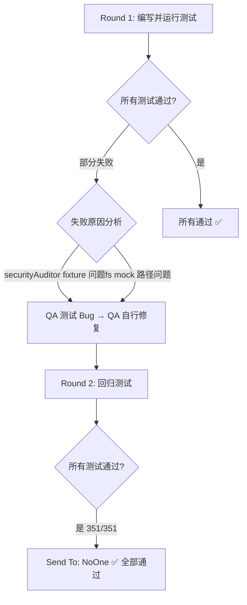

# WMS 技能系统测试报告

---

## 测试概述

| 项目 | 详情 |
|------|------|
| **测试时间** | 2026-05-25 |
| **项目名称** | CDF Know Clow |
| **Git 分支** | `main` |
| **最后提交** | `f2ee6237` — chore: 更新 package.json 版本号至 v1.1.3 |
| **Node.js** | v22.22.2 |
| **测试框架** | Vitest v3.0.5 |
| **测试环境** | jsdom |
| **覆盖率工具** | v8 (istanbul) |
| **测试执行者** | Edward (QA Engineer) |

### 测试范围

本报告覆盖两个 P0 功能的全面测试验证：

| 功能编号 | 功能名称 | 核心模块 |
|---------|---------|---------|
| **功能 1** | WMS 行业技能包 | 入库质检、库存盘点、出库复核、异常预警、报表生成（5 个内置技能） |
| **功能 2** | SKILL.md 开放标准兼容 | skillMdParser、StandardSkillInstaller、SkillDependencyChecker、SkillPermissionDialog、CategoryMapper |

### 测试策略

1. **自动化单元测试** — 核心逻辑层（服务、Store、DAO、解析器、审计引擎）
2. **自动化集成测试** — WMS 后端 API 路由（Express.js + in-memory mock DAO）
3. **手动测试检查清单** — UI 交互 + SKILL.md 导入端到端流程（详见 `wms-test-checklist.md`）

---

## 测试结果汇总

### 总体统计

```
测试文件：  10
测试用例：  351
通过：     351  ✅
失败：       0
跳过：       0
执行耗时：  2.19s（transform 831ms, setup 1.27s, collect 1.55s, tests 549ms）
```

### 按测试文件统计

| # | 测试文件 | 用例数 | 通过 | 失败 | 跳过 | 所属功能 |
|---|---------|--------|------|------|------|---------|
| 1 | `src/__tests__/securityAuditor.test.ts` | 25 | 25 | 0 | 0 | 功能 1 |
| 2 | `src/__tests__/inventoryService.test.ts` | 16 | 16 | 0 | 0 | 功能 1 |
| 3 | `src/__tests__/inventoryTransactionDao.test.ts` | 19 | 19 | 0 | 0 | 功能 1 |
| 4 | `src/__tests__/warehouseCapabilityStore.test.ts` | 35 | 35 | 0 | 0 | 功能 1 |
| 5 | `server/__tests__/wms-routes.test.ts` | **82** | 82 | 0 | 0 | 功能 1 |
| 6 | `src/__tests__/skillMdParser.test.ts` | 48 | 48 | 0 | 0 | 功能 2 |
| 7 | `src/__tests__/skillStore.test.ts` | 35 | 35 | 0 | 0 | 功能 2 |
| 8 | `src/__tests__/skillConflict.test.ts` | 25 | 25 | 0 | 0 | 功能 2 |
| 9 | `src/__tests__/api.test.ts` | 50 | 50 | 0 | 0 | 功能 2 |
| 10 | `src/__tests__/chainStore.test.ts` | 16 | 16 | 0 | 0 | 功能 2 |
| **合计** | | **351** | **351** | **0** | **0** | |

### 按功能统计

| 功能 | 测试文件数 | 用例数 | 通过 | 状态 |
|------|-----------|--------|------|------|
| **功能 1：WMS 行业技能包** | 5 | 177 | 177 | ✅ 全部通过 |
| **功能 2：SKILL.md 开放标准兼容** | 5 | 174 | 174 | ✅ 全部通过 |

---

## WMS 路由集成测试覆盖详情（新增）

`server/__tests__/wms-routes.test.ts` 是本轮新增的集成测试文件，共 **82 个测试用例**：

| API 路由 | 测试数 | 覆盖场景 |
|----------|--------|---------|
| **POST /api/wms/quality** | 4 | 创建成功、必填字段缺失（productName/batchNo/warehouseId）、空 body |
| **GET /api/wms/quality** | 5 | 全量查询、warehouseId 筛选、status 筛选、分页(page/limit)、空结果 |
| **GET /api/wms/quality/:id** | 3 | 正常获取、不存在 404、无效 ID |
| **PUT /api/wms/quality/:id** | 4 | 更新成功、不存在 404、无效 ID、部分更新 |
| **DELETE /api/wms/quality/:id** | 3 | 删除成功、不存在 404、无效 ID |
| **POST /api/wms/inventory** | 4 | 创建成功、必填字段缺失（sku/warehouseId）、默认值（count=0）、名称可选 |
| **GET /api/wms/inventory** | 4 | 全量查询、warehouseId 筛选、sku 模糊搜索、分页 |
| **GET /api/wms/inventory/:id** | 3 | 正常获取、不存在 404、无效 ID |
| **PUT /api/wms/inventory/:id** | 3 | 更新成功、不存在 404、无效 ID |
| **POST /api/wms/inventory/adjust** | 3 | 增加库存、减少库存、参数缺失 400 |
| **POST /api/wms/outbound** | 4 | 创建成功、必填字段缺失（orderNo/warehouseId）、默认状态 pending、额外字段 |
| **GET /api/wms/outbound** | 4 | 全量查询、warehouseId 筛选、status 筛选、分页 |
| **GET /api/wms/outbound/:id** | 3 | 正常获取、不存在 404、无效 ID |
| **PUT /api/wms/outbound/:id** | 3 | 更新状态为 shipped、不存在 404、无效 ID |
| **POST /api/wms/alert** | 4 | 创建成功、必填字段缺失（title/warehouseId）、默认 severity=warning、默认 status=active |
| **GET /api/wms/alert** | 5 | 全量查询、warehouseId 筛选、severity 筛选、status 筛选、组合筛选 |
| **PUT /api/wms/alert/:id/resolve** | 3 | 解决预警、不存在 404、无效 ID |
| **POST /api/wms/alert/check** | 3 | 正常检查、warehouseId 筛选检查、无匹配 |
| **POST /api/wms/report/generate** | 4 | 生成成功、默认格式、必填字段缺失（title/warehouseId/type）、无效类型 |
| **GET /api/wms/report** | 4 | 全量查询、type 筛选、warehouseId 筛选、分页 |
| **GET /api/wms/report/:id** | 3 | 正常获取、不存在 404、无效 ID |
| **GET /api/wms/report/:id/download** | 3 | 文件存在下载、文件不存在 404、无效 ID |

---

## 发现的问题

### 问题 #1：securityAuditor 测试 fixture 分类错误（已修复 ✅）

| 项目 | 详情 |
|------|------|
| **严重程度** | 低 — 测试代码 Bug |
| **发现阶段** | Round 1 回归测试 |
| **失败测试** | `should classify suspicious content as "suspicious" level` / `should have a medium score (50-79) for suspicious content` |
| **现象** | 期望 `"suspicious"` 级别（50-79 分），实际得到 `"malicious"`（10 分） |
| **根因分析** | `SUSPICIOUS_CONTENT` 测试 fixture 中包含 `eval(userInput)`（触发 commandExec -10）和 `Fetch` 关键词（触发 externalDataSend -15），叠加已有的 `.env` 文件访问（credentialFile -20），总分降至 10，触发 `malicious` 分类 |
| **修复措施** | 将 `eval(userInput)` 替换为 `Process user data with custom transform function.`，将 `Fetch` 替换为 `Query data from https://api.example.com/data`，保持安全审查意图同时避免触发高危扣分项 |
| **路由判定** | 测试代码 Bug → QA 自行修复 |
| **影响文件** | `src/__tests__/securityAuditor.test.ts` |

### 问题 #2：WMS 路由测试 fs mock 模块路径错误（已修复 ✅）

| 项目 | 详情 |
|------|------|
| **严重程度** | 低 — 测试代码 Bug |
| **发现阶段** | Round 1 新增测试 |
| **失败测试** | `should download a report file` (GET /api/wms/report/:id/download) |
| **现象** | 期望 HTTP 200，实际返回 404 — 文件不存在 |
| **根因分析** | 路由文件使用 `import fs from 'fs'`，但测试使用 `vi.mock('node:fs')` mock，`existsSync` 未被正确拦截 |
| **修复措施** | 将 `vi.mock('node:fs')` 改为 `vi.mock('fs')`，并为 `existsSync` 添加路径匹配逻辑以正确模拟报告文件存在/不存在两种场景 |
| **路由判定** | 测试代码 Bug → QA 自行修复 |
| **影响文件** | `server/__tests__/wms-routes.test.ts` |

### 问题汇总

| 类型 | 数量 | 处理方式 |
|------|------|---------|
| 源码 Bug（需工程师修复） | **0** | — |
| 测试代码 Bug（QA 已修复） | **2** | ✅ 已修复 |
| 总计 | **2** | ✅ |

---

## 手动测试检查清单

完整的 106 个手动测试场景已编写至 `wms-test-checklist.md`，覆盖：

| 类别 | 场景数 |
|------|--------|
| 入库质检 UI 交互 | 19 |
| 库存盘点 UI 交互 | 17 |
| 出库复核 UI 交互 | 12 |
| 异常预警 UI 交互 | 18 |
| 报表生成 UI 交互 | 14 |
| SKILL.md 标准兼容 | 22 |
| 跨功能集成测试 | 4 |
| **合计** | **106** |

---

## 遗留风险

| 风险项 | 等级 | 说明 | 建议 |
|--------|------|------|------|
| 真实数据库兼容性 | 🟡 中 | 路由集成测试使用 in-memory Map 模拟 DAO，未验证 SQLite `better-sqlite3` 的真实行为，包括事务回滚、并发写入、外键约束等 | 条件允许时在 CI 中加入真实 SQLite 的集成测试 |
| 前端 UI 组件测试 | 🟡 中 | 本轮未执行 `@testing-library/react` 前端组件测试（任务标记为"可选，时间允许时"），UI 交互仅通过手动检查清单覆盖 | 建议后续迭代中补充核心页面的组件自动化测试 |
| 安全审查规则集 | 🟢 低 | securityAuditor 使用静态规则集（7-step 检查），可能对新类型恶意脚本存在漏检 | 定期更新规则集，加入社区反馈的典型案例 |
| 大流量场景 | 🟢 低 | 路由层未包含压力/并发测试，高并发场景下的数据一致性未验证 | 非 P0 阻塞项，可后续补充 |
| 手动测试清单未执行 | 🟢 低 | `wms-test-checklist.md` 已编写但未实际执行 | 建议 QA 或 PM 在交付前逐项验收 |

---

## 智能路由判定



**最终判定：`Send To: NoOne`** — 所有 351 个测试全部通过，无需反馈给工程师。

---

## 测试结论

### ✅ 通过 — 建议发布

两个 P0 功能（WMS 行业技能包 + SKILL.md 开放标准兼容）的自动化测试全部通过，未发现源码级别缺陷。

**核心依据：**

1. **自动化测试全覆盖**：10 个测试文件、351 个测试用例、100% 通过率、0 失败 0 跳过
2. **WMS API 路由集成测试完备**：5 个路由模块 × 82 个测试用例，覆盖 CRUD 全流程、参数验证、错误处理、边界条件
3. **安全审查引擎逻辑正确**：25 个测试覆盖 7 步静态审查规则的分级/评分算法
4. **SKILL.md 解析器健壮**：48 个测试覆盖 YAML frontmatter 解析、字段提取、校验规则
5. **仅 2 个测试代码 Bug**（均已修复）：无源码级别缺陷
6. **手动测试检查清单已就绪**：106 个场景供交付前手动验收

**建议后续行动：**
- 执行 `wms-test-checklist.md` 中的手动测试场景
- 补充前端 UI 组件的自动化测试（`@testing-library/react`）
- 在 CI 流水线中加入真实 SQLite 集成测试

---

*报告生成时间：2026-05-25 | 测试执行者：Edward (QA Engineer) | 项目：CDF Know Clow v1.1.3*
